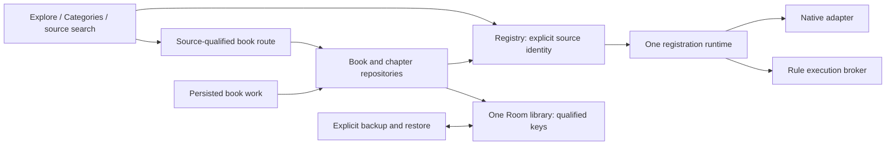

# Host multi-source ownership

#81 completes host retirement of the global source selector after #79 / PR #127
and #80 / PR #128. #95 owns final mixed native/rule-profile acceptance.

## Delivery checklist

- [x] Remove the source-change page, navigation, selected-source setting, global
  provider/DI binding and global missing-source startup message.
- [x] Registration and enumeration do not activate a source. The first explicit
  resolve owns initialization; package removal retires only its registration.
- [x] Remove the synchronous source/explore compatibility facade. Keep source-owned
  scheduling/cache wrappers and the native callbacks still used by book operations.
- [x] Keep explicit library backup/restore; label its user-data lists by ownership.
- [x] Qualify benchmark database fixture identities and identify the fixed native
  debug shortcut.
- [x] Verify one Room/Work chain for equal remote IDs across two sources, including
  browsing/search, reading/statistics, cache/export, reconstruction and restore.
- [x] Verify removal during a request and cached/uncached access after removal.

## Owners and boundaries

| Owner | Responsibility |
| --- | --- |
| SourceBookId / SourceChapterId | Stable source namespace + source ID + remote book/chapter ID; storage keys are independent of title, registration, revision and account. |
| WebBookDataSourceManager | Register native adapters and retain package registration handles. It has no user settings, selected source, requests or database access. |
| WebSourceRegistry / SourceRuntime | Registration lifetime, lazy initialization, cancellation, source-local response cache and scheduling. Resolve by the caller's identity. |
| Explore / Categories entry | Local source selection and page state. Selecting a tab cannot export/clear/import the database or restart the app. |
| SourceSearch / SourceDiscovery | Capture one registration and bind remote books/targets before crossing into host navigation. |
| BookRepository / ChapterRepository | Convert source-qualified host keys to that source's remote IDs and persist responses under the original owner. Cache remains available if the source is removed. |
| Room / Bookshelf / Stats | One library containing all sources. Each book and chapter is distinct even when its title, author or remote number matches another source. |
| Cache / Export / Update Workers | Persist the full owning book key; unique work names and export directories use that identity. A missing source cannot fall back to another source. |
| LocalDataManager | Explicit library backup/import and overwrite restore. Source registration and navigation do not call destructive restore helpers. |

## Removed paths and retained native boundaries

`WebBookDataSourceProvider`, its mutable implementation and missing-source
placeholder are removed. Manager registration no longer reads `WebDataSourceId`
or synchronously resolves a globally chosen runtime. The old Settings.SourceChange
graph and its Apply/restart action are gone. MainActivity and the root NavHost no
longer accept a global source-availability flow. Each page/request already owns
its unavailable/error behavior.

The temporary SourceRuntime source/proxy/explore facade and SourceExploreFacade
are gone because discovery and search now use the explicit runtime contracts.
The priority/coalescing/cache proxy chain remains private to one runtime; it is
used for that runtime's requests rather than a replaceable global value.

There are two explicit native conversion boundaries:

- `BookIdentity.book` accepts a bare ID as Wenku8 for the debug book-ID shortcut;
  its label identifies that source. The same fixed mapping seeds numeric native
  benchmark books, whose database keys are now qualified. Imported sources pass
  SourceBookId keys. No setting, tab, account or registry ordering can change this
  mapping. This is not an old-database migration or old-plugin compatibility layer.
  The detail sheet displays the owning source's remote ID rather than the encoded
  storage key; the existing native benchmark metadata expectation remains valid.
- The existing native volume-cover callback accepts remote volume/chapter IDs.
  `BookRepository.volumeCover` captures the book's runtime, validates ownership and
  converts only that book's data. Tags return a source-qualified discovery target;
  image requests resolve the image's source and its headers. Wenku8's own offline
  poller belongs to its runtime and is no longer a global UI observation.

EmptyWebDataSource remains the default implementation used by rule adapters for
unsupported native methods. It is not selected as a fallback runtime. Existing
non-source plugin installation/restart behavior is independent and remains intact.
API removals and the absence of an external plugin ABI claim are recorded in
[api/CHANGELOG.md](../api/CHANGELOG.md).

## Backup semantics

The active database is never swapped when browsing. Reading-list, download-list
and search-history user-data paths are shared library lists, represented by an
immutable `libraryUserDataPaths` set. Normal export/import continues to carry one
mixed-source library and global settings. CBOR's existing localDataList container
is a backup format detail, not an active source slot.

`cleanDatabaseWithoutGlobalUserData` remains solely for explicitly requested
overwrite restore. ImportDataWork validates the backup before it can call that
method. The existing merge path and settings/cache controls retain their behavior.
Source deletion retires the registration; library rows and reading caches remain
owned by their original IDs. Login/session changes and explicit cache cleanup are
defined separately in [account-switch-semantics.md](account-switch-semantics.md).

If a registration is removed or replaced after resolution, book requests convert
that runtime's cancellation into `SourceUnavailable`. Cache-first flows retain
their cached value, while explicit remote refresh and uncached reads report the
failure. Caller cancellation and unrelated adapter exceptions still propagate;
the request never retries against a replacement or a different source.

## Verification scope

SourceManagerRegistrationTest covers lazy native initialization, missing identity
and stale package removal. WebSourceRegistryTest continues to cover registration
lifetimes, now through production discovery/search instead of the retired facade.

HostMultiSourceIntegrationTest connects production registry/search/discovery,
repositories, file-backed Room, WorkManager, cache/export/update workers,
statistics and CBOR backup. Remote providers are synthetic. Optional display
transformations are disabled and storage-usage invalidation is a test double.
WorkManager's official test scheduler drives the production workers; this proves
host scheduling/persistence contracts, not Android OS background scheduling.
Room is closed/reopened with a new registry/repository graph; that check is not
a physical process kill or WebView/Binder isolation claim.

Earlier per-layer identity, reading-mode, source-image and worker tests remain
relevant. #95 adds rule formats, login/browser/revision/diagnostic combinations and
actual Android isolation evidence. No external novel site or private account is
required for these host checks.
