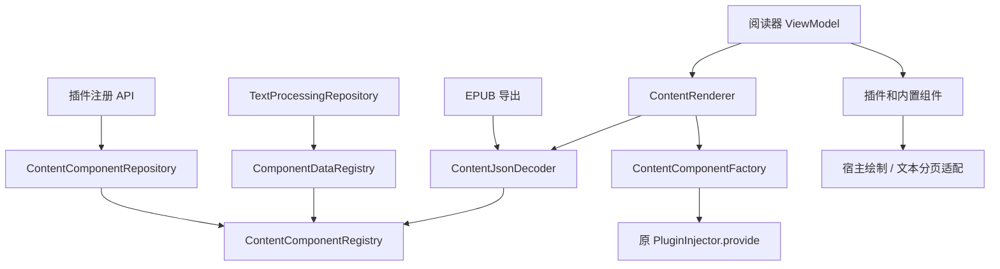

# R5：内容注册、解码、组件创建与宿主适配

R5 对应独立 PR，范围是职责迁移与行为验证。最初以 R3 合并后的主线 `85f04d7a` 建立行为基线，提交前同步包含审计 PR #8 的主线 `513744ce`。本轮发现的问题另记在 [R5 后续问题](r5-content-follow-ups.md)，与[已有问题记录](refactoring-follow-ups.md)一起留待拆分完成后讨论。

## 为什么拆分

原 `ContentComponentRepository` 同时持有注册表、解析 JSON、访问整个插件注入映射、反射创建组件和创建错误 UI。文本处理仅为了读取两张注册表，也必须依赖这个仓库；EPUB 导出只需要数据，却依赖渲染创建入口。内置文本组件还直接承担设置读取、字体测量、分页和 Compose 绘制，图片组件直接处理宿主导航。

## 职责与依赖

| 边界 | 职责 | 消费者 |
| --- | --- | --- |
| `ContentComponentRegistry` | 保存内置/插件注册信息及原有注册构建规则 | 插件门面、解码器 |
| `ComponentDataRegistry` | 提供序列化器与数据类型的只读快照 | `TextProcessingRepository` |
| `ContentJsonDecoder` | JSON 遍历、ID/字段检查、数据反序列化及原有错误策略 | EPUB 导出、阅读内容组装 |
| `ContentComponentFactory` | 把本次数据加入注入参数副本，调用原 `PluginInjector.provide` | 阅读内容组装 |
| `ContentRenderer` | 将解码器和组件工厂组合为 `ContentData`，把错误消息映射为错误组件 | 阅读器、滚动与翻页内容 ViewModel |
| `BuiltInContentRenderers` | 宿主主题、文字绘制、图片请求头/查看器导航、错误绘制 | 内置组件的 `Content` 入口 |
| `TextPagination` / `paginateComponents` | 文本测量与切片 / 顺序适配插件 `split` | 内置文本组件 / 翻页 UI |



`ContentComponentRepository` 保留 `ContentComponentRepositoryApi` 的注册门面。其原本面向宿主的读取、解码和创建方法迁移到对应边界，所有宿主调用方均迁移；没有继续保留一个供新业务依赖的全能入口。Hilt 将 `ComponentDataRegistry` 绑定到同一个单例注册表，插件后续注册的数据仍可被文本处理读取。

这不是把插件 API 改成纯数据协议：`AbstractContentComponent.Content` 和 `AbstractDivisibleContentComponent.split` 仍属于原插件契约，注册元信息仍引用这些类型。内置组件保留原类名、构造参数、组件 ID 和入口，将宿主实现委托出去；没有要求插件实现新的渲染接口，也没有增加并行的插件体系。

## 本轮保持的语义

- `api/` 与 `PluginInjector` 不变。反射仍依次尝试 `INSTANCE`、无参构造、首个参数类型均可精确匹配的 public 构造器；继续使用原宿主 API 注入映射。
- 内置注册项、重复 ID 覆盖、构建器缺参错误和每次读取 `toMap()` 快照的规则不变。文本处理仍在每个处理器调用前分别读取两张快照，能够看到上一处理器期间发生的新注册。
- 渲染先将数组元素转为 JSON 对象，然后逐组件执行字段检查、注册查询、复制注入参数、反序列化、构造。解码器传给工厂的是本次 `decodeData` 回调，使工厂仍在复制参数后才调用序列化器；不会先把整章全部解码后再统一构造。
- 渲染的短 ID 补命名空间、缺字段错误组件、构造无法匹配时的错误消息、类型错误/序列化器异常/构造器异常的传播规则均保留。数据导出仍使用完整 ID，跳过缺少必要字段或序列化器的条目。
- 文本处理的处理器顺序、启用过滤、重复注册规则、章节元信息和 JSON 输出保持；不借本轮补齐当前被丢弃的 JSON 扩展字段。
- 文本分页仍读取原存储路径和 `15f / 7f / 500f / Uri.EMPTY` 默认值，沿用字体解析、密度/布局方向、测量约束、换行切片和首尾空白页过滤。每个分片仍新建一个组件及测量器，没有添加缓存或共享寿命。
- 混合内容继续按原顺序调用 `split(height, width)`，不可分割组件保留原实例。翻页 UI 的 effect key、协程 scope/dispatcher、尺寸来源、结果回写和 PagerState 创建时机保持。
- 宿主绘制保留原主题颜色回退、字体观察、Modifier 传递、图片 Header 获取、图片查看器导航和错误文本；错误组件原本忽略 Modifier 的行为也保留。

## 验证结构

沿用项目已有 JUnit 4、MockK、Robolectric 和 Compose 本地测试设施。新增测试位于 `app/src/test/kotlin`，由现有 `:app:testDebugUnitTest` / GitHub PR 工作流执行；无新增测试框架、CI job 或设备测试。

| 测试 | 验证内容 |
| --- | --- |
| [ContentDecodingContractTest][decode-test] | 通过公开插件注册 API 和真实反射路径验证 fixture；内置构造、覆盖、快照、错误、短 ID、调用顺序与注入器捕获时机 |
| [TextProcessingContentContractTest][processing-test] | 仅依赖注册表，无需建立插件注入器/渲染仓库；同步和挂起入口的完整 JSON 输出、元信息、处理器顺序与注册刷新 |
| [TextPaginationContractTest][text-page-test] | 固定行度量下的原切片输出、首尾空白、负行号边界、设置读取顺序、样式和约束、分片构造 |
| [ContentPaginationTest][page-test] | 混合插件组件的顺序、尺寸参数、对象身份、空输出和失败传播 |
| [BuiltInContentRenderingTest][render-test] | 从组件公开 `Content` 入口验证正文、Modifier、字体/行距/字重、明暗主题回退与错误信息 |

前 18 项测试先在原实现上通过，再迁移测试装配入口。拆分前的全套基线为 63 项（原主线 45 项 + 新增 18 项）；额外 5 项测试覆盖提取后的宿主适配。最终同步 PR #8 后，74 项本地测试（最新主线 51 项 + R5 新增 23 项）及 `:app:assembleDebug` 均通过，包含真实 Hilt 图生成与 APK 构建验证。

测试边界：fixture 仅依赖公开插件 API，使用实际 `PluginInjector.provide`，但不是加载外部 `.lnrp` / DEX 的端到端测试；没有声称执行了 benchmark 目录中的 PotatoLib 插件。分页使用固定行度量以保持跨环境稳定，验证切片和测量输入，不用 Robolectric 代替真机字体整形或像素一致性检查。绘制测试验证语义和文字布局参数，没有发起图片网络请求或设备导航。

```powershell
.\gradlew.bat :app:testDebugUnitTest :app:assembleDebug --console=plain
git diff --check
```

[decode-test]: ../app/src/test/kotlin/indi/dmzz_yyhyy/lightnovelreader/data/content/ContentDecodingContractTest.kt
[processing-test]: ../app/src/test/kotlin/indi/dmzz_yyhyy/lightnovelreader/data/content/TextProcessingContentContractTest.kt
[text-page-test]: ../app/src/test/kotlin/indi/dmzz_yyhyy/lightnovelreader/data/content/TextPaginationContractTest.kt
[page-test]: ../app/src/test/kotlin/indi/dmzz_yyhyy/lightnovelreader/ui/book/reader/ContentPaginationTest.kt
[render-test]: ../app/src/test/kotlin/indi/dmzz_yyhyy/lightnovelreader/ui/book/reader/BuiltInContentRenderingTest.kt
