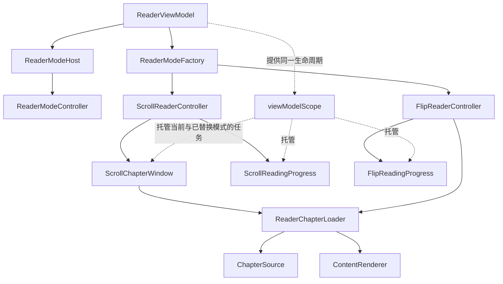

# R6：阅读模式接口与任务所有权

本轮基于 R5 合并后的主线 `31ecc5b9`（PR #9），只迁移职责、收窄依赖和增加行为测试。模式切换、订阅、恢复进度、预加载、节流和退出的功能策略保持；发现的问题见 [R6 后续记录](r6-reader-mode-follow-ups.md)。

## 职责划分

原 `ScrollContentViewModel` 和 `FlipPageContentViewModel` 是普通对象，生命周期实际来自外部传入的 `CoroutineScope`。本轮将其命名为 `ScrollReaderController` / `FlipReaderController`，避免把它们误认为有独立销毁回调的 Android ViewModel。

| 边界 | 责任与依赖 |
| --- | --- |
| `ReaderViewModel` | 阅读器会话、书籍/显式跳章输入、目录观察和阅读记录；持有原 `viewModelScope` |
| `ReaderModeHost` | 选择当前控制器；完成创建、书籍绑定、章节绑定后，交由 ReaderViewModel 发布 UI 状态；相同模式不重复创建 |
| `ReaderModeFactory` | 唯一知道两种控制器实现的构造位置；把同一个阅读器 scope 和记录回调传入所选模式 |
| `ReaderModeController` | 仅提供 UI 状态、切书/切章、上一章/下一章命令；不要求消费者知道模式实现类型 |
| `ReaderChapterLoader` | 共用章节请求与 `Result<ChapterContent>` → `Result<ChapterContentUiState>` 映射；调用 R3 的 ChapterSource 和 R5 的 ContentRenderer |
| `ScrollReaderController` | 滚动模式命令、视口高度输入、连续滚动设置观察与两个协作者的启动顺序 |
| `ScrollChapterWindow` | 前/中/后三个章节槽、对应订阅 Job、连续滚动跨章、直接跳章与相邻 ID 检查 |
| `ScrollReadingProgress` | 滚动进度计算、120ms 观察节流、2500ms 写入限制、停止滚动和显式停止回调 |
| `FlipReaderController` | 翻页模式章节请求、显示结果发布、最近阅读记录与下一章预加载 |
| `FlipReadingProgress` | Pager 更换观察、settledPage 观察、待恢复进度、恢复目标计算 |
| `ContinuousScrollSettings` | 仅提供连续滚动设置的 Flow 和请求时读取；适配同一个 BooleanUserData 与原 true 默认值 |



UI 绘制仍通过 `ContentComponent` 按各自的 `ContentUiState` 选择 Compose 实现；这是 UI 组合边界。模式控制器及其协作者不导入另一模式，不需要另一模式的设置、Pager/LazyList 适配或构造过程。公共映射器不缓存、共享或主动订阅 Flow，也不决定何时预加载。

## 所有权与保持的行为

“明确所有权”在本轮意味着把任务发起和替换位置集中到对应责任中，并明确生命周期由阅读器提供。它不意味着同时增加模式停用时的取消策略。原有模式任务仍托管在同一个 `viewModelScope`；替换控制器只替换显示入口，ReaderViewModel 清理时才结束该 scope。旧任务可能继续运行的行为在本轮保留并测试记录。

| 任务或状态 | 发起/管理位置 | 本轮保持的结束或替换方式 |
| --- | --- | --- |
| 模式设置观察 | ReaderViewModel | 直到阅读器 scope 结束 |
| 滚动连续设置观察 | ScrollReaderController | 同上；设置发射触发原有可见章节观察开关/必要时重新跳章 |
| 三章订阅、可见章节观察 | ScrollChapterWindow | 沿用原 Job.cancel 位置；不额外取消直接跳章后仍存在的相邻订阅 |
| 滚动偏移与停止状态观察 | ScrollReadingProgress | 阅读器 scope 结束；ON_STOP 仍由原 Compose 生命周期回调调用 `writeProgressRightNow` |
| 翻页章节订阅、记录/预加载 | FlipReaderController | 每次请求仍新建任务；不新增旧请求取消或归属校验 |
| Pager/页码观察 | FlipReadingProgress | 更换 Pager 时只替换页码观察 Job；恢复任务仍按原方式排队 |
| 单个模式的 UI 状态 | 控制器创建，专属协作者更新 | 原状态对象及 UI 回调契约保留；章节恢复和实时进度写入的相对顺序保持 |
| 目录请求、阅读统计 scope | ReaderViewModel / 既有 R4 边界 | 沿用原寿命，不与模式任务统一销毁 |
| Compose 分页与滚动恢复 effects | 各自 Compose 实现 | 保留原 effect key、scope、帧等待和布局适配 |

创建控制器后才读取当前书籍 ID，完成书籍绑定后才读取章节 ID。`ReaderModeHost.select` 接收读取函数，保留这两个读取时刻，不把输入提前合成一个快照。UI 状态也仍在绑定之后发布。

## 共用步骤与模式差异

共用部分只有原先相同的章节请求转发和内容映射。滚动模式内部还合并了直接跳章时连续/非连续两条路径中相同的“显示 → 读取记录并恢复进度 → 写最近阅读 → 预加载”部分；连续分支随后才建立相邻订阅。

| 行为 | 滚动 | 翻页 |
| --- | --- | --- |
| 章节请求优先级 | Default | High |
| 请求后的立即状态 | 立即重置三槽、章节 ID、进度和 LazyListState | 空 ID 忽略；有效 ID 先重置进度，收到结果才更新章节 ID |
| 恢复进度 | 在最近阅读记录的变换回调内读取 Map 并赋值 | 独立 IO 任务读取 Map，待非空 Pager 更新时消费 |
| 当前章节成功 | 显示先于记录，记录完成后才预加载 | 相同相对顺序，但请求 ID 和显示数据 ID 的原差异保留 |
| 连续相邻章节 | 预加载完成后，先订阅前章再订阅后章；沿用重复/自引用检查 | 无三槽管理 |
| 从可见内容跨章 | 搬移缓存槽、替换相应订阅，再按已有缓存/新发射更新最近阅读 | 由 Pager 与章节命令决定，不复用滚动迁移步骤 |
| 进度写入 | 120ms 观察门槛与 2500ms 写入门槛分开；完成进度和停止滚动有原有例外 | settledPage 按 `(page + 1) / pageCount` 计算，Pager 更换时重新观察 |

所有显式 Main/IO 与继承 reader scope 的 launch 位置保持。为可控测试提供 dispatcher 参数，默认仍是原 Dispatchers；滚动节流与进度观察提供同一可控毫秒来源，默认仍使用 `System.currentTimeMillis`，没有切换计时规则或增加定时补发。

## 验证

继续使用现有 `app/src/test/kotlin`、JUnit/MockK/Robolectric/协程测试设施和现有 PR workflow，无新增 CI job 或设备测试。测试输入使用受控 Flow、持久化/预加载挂起点、Compose snapshot 和可控时钟。

- [FlipModeContractTest][flip-test] / [ScrollModeContractTest][scroll-test]：其中 18 项先在原控制器实现上通过，再只迁移测试装配入口；覆盖映射、请求参数、成功/错误发射、写入/预加载顺序、恢复、三槽迁移、订阅替换与 scope 取消。
- [ScrollProgressTimingTest][timing-test]：锁定 120ms 与 2500ms 两个窗口、完成进度的写入例外、停止时重复写入、暂存偏移不会仅靠时间自动补发。
- [ReaderModeHostTest][host-test]：创建/绑定顺序、输入读取时刻、相同模式去重、命令路由与返回模式的新建行为。
- [ReaderModeOwnershipTest][ownership-test]：实际 ReaderViewModel + 可记录的模式替身，验证 UI 发布、最后显式跳章输入、同一 reader scope 的传递、模式替换不取消任务及 ViewModelStore.clear 取消所有模式任务。
- [ReaderChapterLoaderTest][loader-test]：独立订阅、组件实例、结果顺序、取消隔离和渲染异常传播。
- [ContinuousScrollSettingsTest][settings-test]：沿用原设置句柄、Flow 和请求时 true 默认值。

这些测试验证控制器/宿主的语义一致性，不代替实际 Compose 排版、真实书源网络或设备绘制。原来的阅读器选择/窗口/计时等测试继续执行。已知错误的特征断言服务于本轮拆分，不代表后续必须保留这些错误。

本地验证结果：拆分前基线提交 `71a0a0b2` 的 92 项测试通过；职责迁移后同一基线通过；最终全套 103 项测试通过（原有 74 项、本轮新增 29 项，失败/错误/跳过均为 0），`:app:assembleDebug` 成功。验证继续由现有 JVM 测试任务执行，不要求连接真机或模拟器。

```powershell
.\gradlew.bat :app:testDebugUnitTest :app:assembleDebug --console=plain
git diff --check
```

[flip-test]: ../app/src/test/kotlin/indi/dmzz_yyhyy/lightnovelreader/ui/book/reader/content/flip/FlipModeContractTest.kt
[scroll-test]: ../app/src/test/kotlin/indi/dmzz_yyhyy/lightnovelreader/ui/book/reader/content/scroll/ScrollModeContractTest.kt
[timing-test]: ../app/src/test/kotlin/indi/dmzz_yyhyy/lightnovelreader/ui/book/reader/content/scroll/ScrollProgressTimingTest.kt
[host-test]: ../app/src/test/kotlin/indi/dmzz_yyhyy/lightnovelreader/ui/book/reader/mode/ReaderModeHostTest.kt
[ownership-test]: ../app/src/test/kotlin/indi/dmzz_yyhyy/lightnovelreader/ui/book/reader/mode/ReaderModeOwnershipTest.kt
[loader-test]: ../app/src/test/kotlin/indi/dmzz_yyhyy/lightnovelreader/ui/book/reader/mode/ReaderChapterLoaderTest.kt
[settings-test]: ../app/src/test/kotlin/indi/dmzz_yyhyy/lightnovelreader/ui/book/reader/content/scroll/ContinuousScrollSettingsTest.kt
