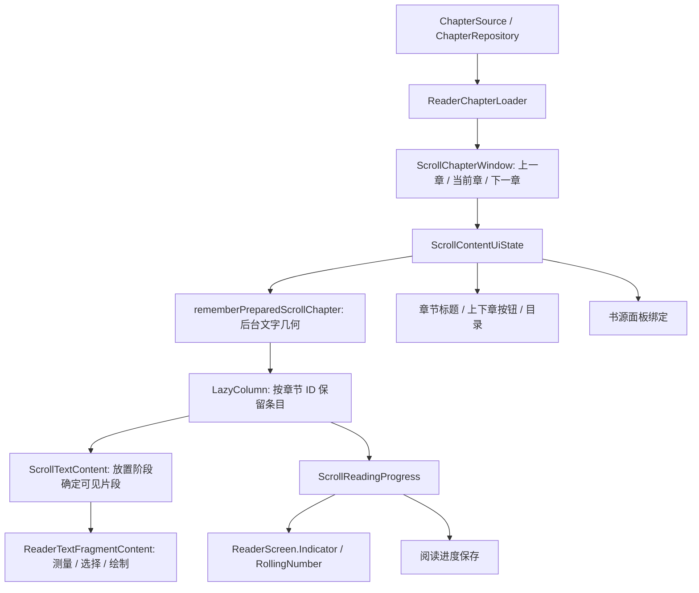
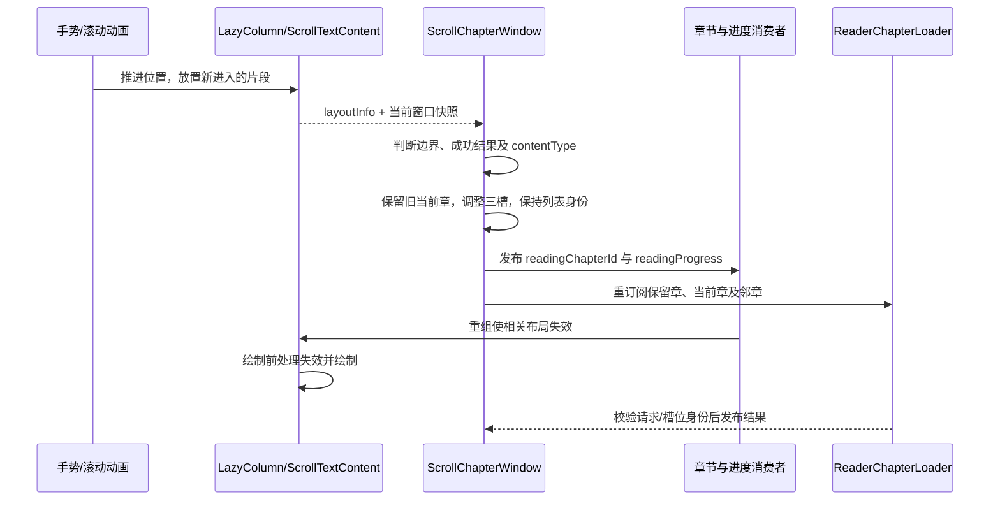
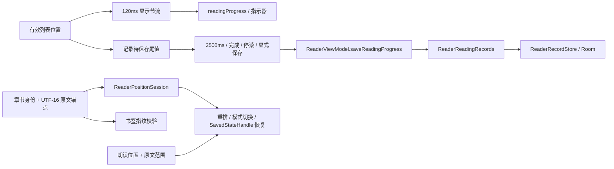

# 阅读页界面更新与性能排查

本文描述当前阅读页的状态归属、更新时序和排查边界。具体设备、书籍、录屏、探针、帧样本与对照结果留在仓库外；本文不把单次测量当作通用性能预算。

## 相关问题与阅读顺序

- [#625：连续跨章的界面更新拆分](https://github.com/Renakoni/nextvol/issues/625) 是本文重点：找到同帧失效的来源并减少实际组合、测量和放置工作。
- [#621](https://github.com/Renakoni/nextvol/issues/621) / [#623](https://github.com/Renakoni/nextvol/pull/623) 提供完整应用的跨章追踪，以及正文片段、章节对象、固定数字槽位和导航观察的优化依据。JIT 代码缓存锁等待另行分析，不计入本地布局 CPU 收益。
- [#620](https://github.com/Renakoni/nextvol/issues/620) / [#619](https://github.com/Renakoni/nextvol/pull/619) 解释正文与进度错位的回归；[更早的 #599](https://github.com/Renakoni/nextvol/pull/599) 解释为什么必须在当前 placement 生成可见正文。历史实现的 slot 策略不能直接照搬：当前标识已细化为 `layout to fragmentIndex`。
- [#545](https://github.com/Renakoni/nextvol/issues/545) 与 [Reader performance baselines](../tests/benchmark/READER_PERFORMANCE.md) 定义准备、排版、首段可读、帧分布与构建差异。该宿主不包含完整 `ReaderScreen` / 导航，不能单独验收本项。

以下代码入口均相对于仓库；名称保留源码拼写，例如 `MutableScrollContentUiSate`、`content/componet`。表中的“需要更新”表示语义依赖，不表示每次都重新执行整棵子树。Compose 的跳过、实际测量和节点复用必须另行观察。

## 状态从哪里来



| 状态或结果 | 归属与消费位置 | 更新约束 |
| --- | --- | --- |
| 当前书籍、阅读模式、目录 | `ReaderViewModel` / `ReaderScreenUiState`；导航、正文和面板消费 | 阅读会话跟随导航入口；模式切换期间可能同时存在进入和退出的渲染器。 |
| 三章窗口、当前章节、`LazyListState` | `ScrollChapterWindow` / `ScrollContentUiState` | 连续跨章保留列表身份；显式跳章可新建列表并恢复位置。旧请求和旧槽位结果必须被身份检查拦截。 |
| 处理后的章节对象 | `ReaderChapterLoader` | 仅在书籍及完整处理后源数据相等时复用保留对象；标题、相邻章节或正文变化均不能按 ID 直接复用。 |
| 字体、行高、段距等排版输入 | `rememberReaderTextLayout` / `LocalReaderTextLayout` | 输入同时供正文、预览和分页使用；无关进度变化不能构造新的排版输入。 |
| 实际可用正文区域 | `resolveReaderBodyLayout` / `readerBodyGeometry` | 布局、分页和恢复位置使用相同像素尺寸；不能用全屏高度代替正文视口。 |
| 当前实际布局状态 | `LocalReaderLayoutResult` | 活跃渲染器在 `SideEffect` 中报告；设置页显示实际结果。滚动模式按模式对象保留容器；翻页模式仍按当前成功正文重置。尺寸/设置变化继续报告，不能显示旧章翻页布局。 |
| 章节片段几何 | `PreparedScrollChapter` / `ScrollTextLayout` | 后台准备；任务取消后不能发布旧输入结果。设置重排期间可暂时显示原几何，再通过原文锚点恢复。 |
| 阅读百分比 | `ScrollReadingProgress` | 滚动采样、显示更新和持久化具有不同节奏；停滚、离开页面及恢复屏障有单独处理。 |
| 原文位置、书签和朗读位置 | `ReaderPositionSession`、`ReaderBookmarkSession`、`ReaderSpeechFollow` | 使用章节身份和 UTF-16 原文锚点；旧渲染器不能完成新请求，也不能继续处理输入。 |

主要入口：[ReaderScreen.kt](../app/src/main/kotlin/indi/renakoni/nextvol/ui/book/reader/ReaderScreen.kt)、[Navigation.kt](../app/src/main/kotlin/indi/renakoni/nextvol/ui/book/reader/Navigation.kt)、[ScrollContentComponent.kt](../app/src/main/kotlin/indi/renakoni/nextvol/ui/book/reader/content/scroll/ScrollContentComponent.kt)。

## 从进入阅读页到正文可见

| 阶段 | 调用入口与发布内容 | 线程、身份与退出条件 |
| --- | --- | --- |
| 导航与会话 | [Navigation.kt](../app/src/main/kotlin/indi/renakoni/nextvol/ui/book/reader/Navigation.kt) 的 `bookReaderDestination` → `ReaderViewModel.openBook` | VM 使用 Book 图作用域及阅读入口 ID；位置会话、书签和书源面板跟随阅读入口。生命周期负责前台执行资格，面板绑定在 effect 的 `snapshotFlow` 内观察章节。 |
| 模式建立 | [ReaderViewModel.kt](../app/src/main/kotlin/indi/renakoni/nextvol/ui/book/reader/ReaderViewModel.kt) → [ReaderModeHost.select](../app/src/main/kotlin/indi/renakoni/nextvol/ui/book/reader/content/ReaderModeHost.kt) → [ReaderModeFactory.create](../app/src/main/kotlin/indi/renakoni/nextvol/ui/book/reader/content/ReaderModeFactory.kt) | 模式有自己的协程作用域。切换前捕获锚点，旧控制器关闭，绑定新书/章与位置会话后发布新 `contentUiState`。 |
| 显式加载 | [ScrollReaderController](../app/src/main/kotlin/indi/renakoni/nextvol/ui/book/reader/content/scroll/ScrollReaderController.kt) → `ScrollChapterWindow.changeChapter` | 清空三槽、建立新 Request 与 `LazyListState`、开启恢复屏障；读取连续滚动设置，再订阅当前章。这里与自然跨章不同。 |
| 数据来源 | [ChapterRepository.getChapterContentFlow](../app/src/main/kotlin/indi/renakoni/nextvol/data/book/ChapterRepository.kt) | 本地书直接读本地；可信章节缓存直接返回；旧缓存先发布，再走书源刷新，刷新失败时保留已有本地正文。处理规则在 Flow 后续 `map` 中执行。目录是独立 Flow，不能从正文缓存命中推断目录不刷新。 |
| 组件准备 | [ReaderChapterLoader.load](../app/src/main/kotlin/indi/renakoni/nextvol/ui/book/reader/content/ReaderChapterLoader.kt) → `ContentRenderer.getContentDataFromJson` → `ChapterContentUiState` | 窗口通过 `flowOn(ioDispatcher)` 收集准备工作。订阅内去重完整成功源数据；重订阅仅在书籍及完整处理后源数据相等时使用 `retainedContent`，错误后成功仍能恢复。 |
| 窗口发布 | [ScrollChapterWindow.collectChapter](../app/src/main/kotlin/indi/renakoni/nextvol/ui/book/reader/content/scroll/ScrollChapterWindow.kt) → `contentList[index]` | 窗口协程发布 UI 状态，I/O 不拥有可变窗口。Request 身份、slot generation 在挂起点两侧挡住过期结果；当前章元数据先准备再发布。邻章禁止交互请求，重试可显式允许。 |
| 正文几何 | [ScrollContentTextComponent](../app/src/main/kotlin/indi/renakoni/nextvol/ui/book/reader/content/scroll/ScrollContentComponent.kt) → [rememberPreparedScrollChapter](../app/src/main/kotlin/indi/renakoni/nextvol/ui/book/reader/content/scroll/ScrollTextLayout.kt) | `onSizeChanged` 获得宿主尺寸，`resolveReaderBodyLayout` 减去真实边距/指示器空间。每个任务在 `Dispatchers.Default` 使用独立 TextMeasurer；准备全部片段几何，取消任务不发布旧结果。 |
| 列表与显示 | `LazyColumn.itemsIndexed` → `TextContent` → `ScrollTextContent` / 非文字组件 `Content` | Lazy 条目 key 为章节 ID，准备任务外层 key 为列表身份和章节 ID；每次实际放置只组合、测量附近文字片段。共享选择容器保留跨段选择。 |
| 首次定位 | `ScrollContentTextComponent` 内恢复 effect → `scrollToItem` → `onProgressRestored` | 列表可先在加载层后布局。当前章几何、位置和组件坐标准备好后才显示正文；`entryReady` 使后续重排不重新盖上整页加载层。 |

`reader.prepare` 是 JSON/组件准备切片，`reader.layout` 是文字几何计算切片；它们不是网络等待，也不是 `AndroidOwner:measureAndLayout`。将章节加载、后台排版与主线程布局混称“排版”，会把三种不同成本归给同一层。

### 四层身份不能混为一谈

| 身份 | 当前实现 | 能复用什么、不能推导什么 |
| --- | --- | --- |
| 订阅请求 | Request 对象、slot generation、连续观察 generation | 拦截旧任务结果；取消请求不代表删掉仍在窗口内的正文对象。 |
| 处理后正文 | `ChapterContentUiState.source = bookId to processedChapter` | 完整数据相等才保留组件和几何输入；同 ID 不足以证明标题、相邻章关系或正文不变。 |
| 章节 UI / 准备任务 | Lazy key 为章节 ID；准备 key 含 `listState` 和章节 ID | 连续窗口移动可保留重叠章节；章节离开 Lazy 可见范围后，UI 节点仍可能销毁，再进入需要重新创建。 |
| 可见文字片段 | `subcompose(layout to index, content)` | 同几何同片段保留节点；新布局不能套用旧正文或缓存的 Placeable。lookahead 与实际 placement 可有不同可见范围。 |

## 章内滚动、自然跨章与显式跳章

章内移动由拖动、fling 或音量键推进 `LazyListState`。`ScrollTextContent` 在 placement 中读坐标，因此祖先仅改变放置位置时也能重新求可见范围；当前片段两侧各多保留一个片段。列表位置被 `ScrollChapterWindow`、`ScrollReadingProgress` 和位置捕获各自观察，它们的判定目的和节奏不同。

可见片段必须在当前 placement 内完成组合、测量和放置，再进入绘制。从 `onGloballyPositioned` 回写可见范围、等下一帧补正文，会使快滑显示空白或旧文字；不同正文范围共用 `Unit` 子组合槽位，还会在 lookahead 环境错误复用旧内容。不能通过推迟正文或复用旧 Placeable 换取更少的布局调用。

`ScrollChapterWindow.startContinuousObservation` 用 `snapshotFlow` 观察首个可见条目和窗口副本，并在恢复屏障打开时停止晋升。下跨章要求首个条目的 key 已是下一章；上跨章还要求上一章条目 `offset <= -viewportHeight`。因此“上一章露出”“手势方向向下”和“当前章已晋升”不是同一事件。上跨章的节点创建尖峰可能发生在正式晋升帧之前，分析必须覆盖整个边界经过区间。



图是依赖关系，不保证每个步骤在同一帧完成。发布后三章订阅、持久化和后台几何可在后续帧发生；不能因时间接近就认定它们阻塞了边界帧。

| 触发 | 列表、进度与恢复行为 | 必须保留的区别 |
| --- | --- | --- |
| 自然跨章 `promoteAdjacent` | 保持 `LazyListState`；先确认邻章成功且条目 `contentType == true`，移槽并同步计算新章进度；重订阅不恢复历史百分比 | 不是新的位置请求。恢复 effect 对已经就绪且几何未变的自然晋升直接返回。 |
| 目录/外部指定章节 `changeChapter` | 新列表，进度先归零；当前章发布前可读历史百分比 | 已有原文锚点、书签或朗读目标优先于百分比恢复。 |
| 上下章按钮 | 新列表，`restoreProgress = false`，从章首进入 | 不能因为此前读过而恢复到旧进度；失败重试在初始恢复完成前也保留该语义。 |
| 连续/单章设置切换 | 启停连续观察，必要时重载当前章并保留位置请求 | 不复用自然晋升的路径跳过重排/恢复屏障。 |
| 字体、边距、视口重排 | 可暂时显示已有几何；新几何到位后按原文锚点恢复 | 捕获/完成请求要匹配正文、布局、视口与活跃渲染器。重排不是新的阅读事件。 |
| 当前章/邻章失败 | 当前章可显示错误并重试；失败或尚未测成正文的邻章不能晋升 | 内容恢复成功与条目重新测量之间仍有间隔，不能只检查 Result 成功。 |

### 同一帧内的更新次序

同一主线程帧可以出现以下顺序：

1. `Recomposer:animation` 内的滚动推进触发布局、放置及新片段组合。
2. 章节窗口、标题、按钮和百分比的状态变化触发 `Recomposer:recompose`。
3. `Record View#draw()` 前的 `AndroidOwner:measureAndLayout` 处理新失效的布局，再绘制。

这能解释同帧两次 `AndroidOwner:measureAndLayout`，但不能只凭次数断言重复计算，也不能把两次调用直接等同于 lookahead / approach。预测布局是另外一层机制；需检查具体父子切片和输入变化。若要改变跨章发布时机或布局方式，必须重新验证当前帧文字、标题、进度、选择和恢复位置的一致性。

## 哪些状态会使哪里更新

### 章节和进度的读取范围

[ScrollContentUiState.readingChapterContent](../app/src/main/kotlin/indi/renakoni/nextvol/ui/book/reader/content/scroll/ScrollContentUiState.kt) 是“用 `readingChapterId` 扫描 `contentList`”的 getter，没有单独的当前章状态槽。在组合阶段读它，也会订阅窗口列表；相邻槽位发布可能使读取作用域失效，即使当前章正文没有变。`remember` 与 effect 的键表达式同样是在组合阶段读取，不能只检查 `Text(...)`。

| 消费入口 | 读取内容与时机 | 维护边界 |
| --- | --- | --- |
| `ReaderScreen` 的布局结果容器 | 滚动模式只按模式对象记忆；其他模式继续将当前成功正文作为 key | 滚动几何与章节无关，避免因晋升替换 provider；模式切换仍创建新容器，翻页章节变化仍使旧结果失效。 |
| `ReaderScreen` 的书签失败 effect | 仅存在 pending 书签时读取当前章节内容作为 effect key | 普通阅读不为一个空操作订阅窗口；pending 出现、章节失败或请求替换时仍会更新。 |
| 工具栏槽位 | 菜单显示时读取 `chapterTitle` 与当前章上下邻接关系 | 需要及时更新标题和按钮；局部槽位重组不等于整个 `ReaderScreen` 或导航重组。 |
| `Content` 的指示器槽位 | 当前章节标题与 `readingProgress` | 百分比有节流，晋升也会同步写进度；固定数字槽位避免位数改变时集中建节点，但动画仍有成本。 |
| 目录选择 | 目录弹层内读取当前章节 ID 与目录数据 | 当前章变更要更新选中项；目录刷新不能无故抹掉手动浏览的卷和位置。 |
| 书源面板 | `Navigation` 的 effect 内读取模式对象与章节 ID；打开面板时再即时绑定 | 章节变化使旧上下文失效，但仅此观察不使导航组合失效。 |
| 正文渲染器 | 窗口、列表、当前章、排版输入与活跃身份 | 准备任务、恢复和当前正文的必要更新仍要执行，不能为了减少重组展示旧数据。 |
| 持久化/位置捕获 | effect 内 `snapshotFlow`、事件回调 | 不需要将采样放到顶层组合；进度保存与精确锚点有不同有效性和时序。 |

只稳定布局容器，而保留无条件书签 effect key，仍会在顶层读当前章。反过来只条件化书签检查，布局容器的 key 也仍会订阅窗口。两处读取需要一起检查，不能把没有变化的子树全部归因于某一个 getter。

### CompositionLocal 与布局结果

| Local | 类型/提供者 | 消费与失效 |
| --- | --- | --- |
| `LocalReaderTextLayout` | static local；`Content` 由 `rememberReaderTextLayout` 生成 | 正文、正文区域解析与准备任务使用统一排版输入。static local 的值变化会使 provider 内容失效，因此进度不能成为排版输入。 |
| `LocalReaderLayoutResult` | dynamic local；`ReaderScreen` 提供 MutableState 容器 | 滚动/翻页渲染器读取容器，在 `SideEffect` 报告；设置项读取 `.value`。替换容器与写入容器值是两种不同通知，后者不使只持有容器的渲染器变成值消费者。 |
| `LocalReaderRendererActive` | dynamic local；模式 `AnimatedContent` 内提供 | 当前模式为 true，退出模式为 false；保护报告、手势、位置与书签回调，不能只看旧 UI 是否仍挂载。 |
| `LocalReaderPositionSession` / `LocalReaderBookmarks` | 位置会话由导航提供，书签会话按书籍记忆 | 模式内容只向活跃渲染器提供有效会话；token 和请求身份还会在异步完成时再次核验。 |
| `LocalReaderSpeechFollow` / `LocalReaderSpeechRanges` | 阅读页跟随状态 / 正文章节范围 | 高亮、索引准备、自动跟随与手动取消；语音状态变化不应借章节窗口缓存冻结。 |
| `LocalReaderVolumeKeysEnabled` / `LocalReaderSelectionState` | 内容宿主 / 选择容器 | 菜单、弹层、退出模式或有效文字选择要释放按键/手势控制权。 |

滚动模式的 [resolveReaderLayout](../app/src/main/kotlin/indi/renakoni/nextvol/ui/book/reader/ReaderLayoutPolicy.kt) 在检查双页能力前返回 `ScrollMode`；章节内容不参与其视口几何决策。因此同一滚动模式跨章可保留结果容器，新的边距/尺寸仍由渲染器正常报告。这不等于缓存正文几何或取消恢复检查。

翻页模式不同：[FlipPageContentComponent](../app/src/main/kotlin/indi/renakoni/nextvol/ui/book/reader/content/flip/FlipPageContentComponent.kt) 根据组件是否支持双页解析布局，且只有 `renderedInput == paginationInput` 才报告实际结果，否则为 `AwaitingMeasurement`。新章加载/失败时成功正文 key 也会变化，不能沿用旧章的单/双页状态。

## 从滚动位置到保存、书签与朗读

`readingProgress` 是章节百分比，不是画面是否正确的证明，也不是长期保存的字符位置。[ScrollReadingProgress](../app/src/main/kotlin/indi/renakoni/nextvol/ui/book/reader/content/scroll/ScrollReadingProgress.kt) 的有效样本同时包含书籍、章节对象、列表、revision、条目尺寸和视口高度，按 `(-offset + viewportHeight) / itemSize` 计算并限制在 `[0, 1]`。它表示视口底部对应的章节比例，不能直接拿来当顶部原文锚点。



滚动中先记住有效尾值，再对显示节流；通常间隔至少 2500ms 才写库，但完成章节、停滚及显式保存有独立路径。恢复开始前冲刷已授权的旧样本，恢复完成只解除布局屏障，不自动算作阅读；实际用户移动/明确定位后才解除对应写入屏障。位置或正文已经换掉的样本不应覆盖新章。

[ReaderViewModel.saveReadingProgress](../app/src/main/kotlin/indi/renakoni/nextvol/ui/book/reader/ReaderViewModel.kt) 再绑定当前模式、书籍和正文对象；[ReaderReadingRecords.saveProgress](../app/src/main/kotlin/indi/renakoni/nextvol/ui/book/reader/ReaderReadingRecords.kt) 在事件源排序，合并尚未执行的同章连续事件并保留峰值。排队旧章写入可更新其历史，但不能覆盖更新的续读章节；进度重置 revision 由 store 层拦截。不要用减慢保存来换取本项 UI 帧耗时下降。

[ReaderPositionSession](../app/src/main/kotlin/indi/renakoni/nextvol/ui/book/reader/content/ReaderPositionSession.kt) 用渲染器 token、当前请求和内容指纹保护原文锚点；checkpoint 可写入 SavedStateHandle。无保存状态的全新入口仍可能按章节/比例恢复，不能声称所有冷启动都有字符级恢复。

[书签会话](../app/src/main/kotlin/indi/renakoni/nextvol/ui/book/reader/bookmark/ReaderBookmarkSession.kt) 捕获时要求布局有效且列表静止；跳转后核对书/章与正文指纹，在后台求锚点，再由仍持有请求的活跃渲染器完成。失败提示要保留，旧回调不能清掉新请求。

[ReaderSpeechFollow](../app/src/main/kotlin/indi/renakoni/nextvol/ui/book/reader/content/ReaderSpeechFollow.kt) 只对目标章节准备朗读索引。跟随目标、暂停状态、生命周期和弹层控制自动定位；用户滚动、手动跳章、选择文字会取消跟随。减少章节消费者时不能取消这些必要读取。

## 性能排查顺序

1. **固定场景。** 区分章内快速滑动、上跨章、下跨章、显式跳章；记录菜单/沉浸式、无痕设置、缓存状态、浮窗、字体、刷新率、温度、预热次数和手势时长。保留用户正在使用的通话或视频条件；不同条件的样本不要直接配对。
2. **先看干净构建。** 保存代码版本、APK、构建类型和真实编译状态。录屏与正式帧追踪分开采样，减少录屏引入的额外负载。只使用指定设备序列号。
3. **检查追踪完整性。** 验证 trace 起止、缓冲区覆盖/溢出、丢失事件和时间戳问题；缺失首段的环形缓冲区不能用于“尖峰消失”的结论。
4. **区分工作与等待。** 主线程 `Choreographer#doFrame` 墙钟时间包含阻塞和调度等待；通过 `sched` / `thread_state` 求实际 CPU 时间。绘制提交和屏幕呈现仍需 FrameTimeline；不能将主线程切片直接称为端到端触控延迟。
5. **关联具体工作。** 对照 `reader.prepare`、`reader.layout`、重组、文字节点测量及 `AndroidOwner:measureAndLayout` 的时间关系。网络请求在附近出现，并不证明它阻塞了该帧。
6. **必要时再加探针。** 统计进入片段、节点身份、内容输入和布局轮次；函数级 `CompositionTracer` 可临时桥接到 `android.os.Trace`。探针有开销，不能将带探针样本与干净 APK 的耗时直接比较，也不能记录用户正文进入仓库。
7. **同条件验证并检查正确性。** 除整体分布外单列跨章帧及异常帧；检查首帧文字、上下往返、长段落、跨段选择、标题/进度、设置重排与位置恢复。像素扫描只能排查整屏空白，不能证明完全没有闪烁。

### JIT 与编译状态

`Lock contention on Jit code cache` 是运行时锁等待。沿 owner tid 查找 JIT 线程的 `GarbageCollectCache`、`Code cache collection`、`RemoveUnmarkedCode`，再核对该线程的运行/等待状态。代码缓存回收与 Java 堆 GC 不应混为一谈；主线程在这段时间睡眠，也不等于在等待网络。

编译命令返回 `Success` 不代表目标 APK 获得了请求的 AOT 模式。支持 ART shell 的设备上可分别执行：

```sh
adb -s <serial> shell cmd package compile -m speed -f <package>
adb -s <serial> shell pm art dump <package>
```

检查实际 `status` 和 `reason`。调试构建可能仍为 `verify`，此时不能将它标为“Full / speed 已生效”。不要通过全局关闭 JIT、修改系统运行时参数或放宽帧预算掩盖问题。

非调试、相同代码与数据的诊断构建可用于隔离 debuggable / AOT 的影响，但未压缩的诊断 APK 不等于正式发布 APK；强制 `speed` 也不代表普通用户安装后的编译状态。正式发布性能需要单独检查冷/暖启动、实际优化构建及 profile 覆盖。是否投入 baseline profile 或更大界面重构，应由这些测量决定。

## 继续拆分的证据要求

| 候选 | 已知依赖/可检验假设 | 继续条件 |
| --- | --- | --- |
| 缩小高层章节读取 | 布局容器与空书签检查原本都在顶层订阅当前章；滚动几何不依赖章节 | 先验证作用域与容器身份，再测完整应用的两种菜单状态；不能从重组减少直接推算毫秒收益。 |
| 标题/进度动画局部化 | 消费者需要实时章节/进度，但不必驱动正文几何 | 用成对探针确认哪一轮布局中的节点实际重测；关闭动画可作诊断变量，不直接作为最终产品方案。 |
| 批量窗口发布/稳定槽位 | 晋升会清空并重填三槽，读窗口的消费者可能失效 | 先记录发布事务、slot/key、实际重新创建/测量数；同一个同步发布过程里的赋值条数不等于重组次数。 |
| 推迟章节发布、重写容器或取消预测布局 | 会改变当帧正文、标题/进度、输入和位置恢复的关系 | 先给出实测成本占比、预期收益和回归面；仅看到两个 owner 布局调用不足以立项实施。 |

定向测试可以证明状态归属、局部失效与正确性契约；真机性能要独立报告。保留改动的收益也可以是职责更清楚、减少无关订阅、补全失效契约，而不要求每一项都带来可测的帧耗时下降。此时应说明结构上的具体收益，并核对同条件样本没有明显性能退化；不能把结构收益写成已经量化的流畅性提升。

## 验证范围与继续优化的边界

按实际改动选择测试，不把本表当作一次必须执行的全套命令。测试不能代替真机帧追踪，也不要在本地运行全量套件。

| 要保护的契约 | 定向入口 |
| --- | --- |
| 阅读页状态归属、菜单/沉浸式标题、视口更新、模式/翻页章节失效、书签失败 | [ReaderScreenUpdatesTest](../app/src/test/kotlin/indi/renakoni/nextvol/ui/book/reader/ReaderScreenUpdatesTest.kt) |
| 当前帧文字、lookahead、重叠片段身份与跨段选择 | [ScrollTextFirstDrawTest](../app/src/test/kotlin/indi/renakoni/nextvol/ui/book/reader/content/scroll/ScrollTextFirstDrawTest.kt)、`ScrollTextWindowTest` |
| 过期请求/槽位、失败邻章、自然晋升 | [ScrollChapterWindowTest](../app/src/test/kotlin/indi/renakoni/nextvol/ui/book/reader/content/scroll/ScrollChapterWindowTest.kt)、`ScrollModeContractTest` |
| 完整源数据去重、重订阅复用、错误恢复 | [ReaderChapterLoaderTest](../app/src/test/kotlin/indi/renakoni/nextvol/ui/book/reader/mode/ReaderChapterLoaderTest.kt) |
| 进度尾值、恢复屏障、正文入口 | [ScrollProgressTimingTest](../app/src/test/kotlin/indi/renakoni/nextvol/ui/book/reader/content/scroll/ScrollProgressTimingTest.kt)、`ScrollRestorationTest`、`ScrollEntryLoadingTest` |
| 原文位置、退出模式的所有权 | [ReaderPositionSessionTest](../app/src/test/kotlin/indi/renakoni/nextvol/ui/book/reader/ReaderPositionSessionTest.kt)、`ReaderModeHostTest` |
| 实际页面布局与设置文案 | [ReaderLayoutPolicyTest](../app/src/test/kotlin/indi/renakoni/nextvol/ui/book/reader/ReaderLayoutPolicyTest.kt)、`ReaderPageLayoutSettingsTest` |
| 标题/目录、数字槽、书源面板 | `ReaderDirectoryScreenTest`、`RollingNumberTest`、`ReaderSourcePanelViewModelTest` |
| 书签、朗读与模式动画 | `ReaderBookmarksUiTest`、`FlipSpeechFollowTest`、`ReaderMotionTest` |

例如修改 `ReaderScreen` 的布局结果归属后，可先运行：

```sh
./gradlew :app:testDebugUnitTest --tests '*ReaderScreenUpdatesTest' \
  --tests '*ReaderPageLayoutSettingsTest' --tests '*ReaderLayoutPolicyTest' \
  --max-workers=2 --no-parallel
```

Windows PowerShell 使用 `./gradlew.bat`，将命令写成一行。正文或窗口实现有变化时，再选择相应测试；不要并行启动多个重型构建，构建期间不要编辑该 worktree。

真机至少区分上跨章、下跨章和章内快速滚动，并覆盖菜单可见/沉浸式。每组记录代码/APK、版本号、构建类型/压缩、实际 ART 状态、设备/系统/刷新率、内容/缓存/字体、浮窗、温度、预热和有效样本数。逐次核对实际章节变化；固定手势数量不保证跨章工作量相同。报告全程帧分布、边界经过区间与晋升帧的区别、墙钟/CPU、JIT 等待，以及组合/布局工作量。仅记录 owner 次数不足以判断性能。

受控的渲染器基准及命令见 [Reader performance baselines](../tests/benchmark/READER_PERFORMANCE.md)。其 `readerBenchmark` 宿主涵盖真实 VM、仓库和正文渲染器，但没有完整的 MainActivity 导航和 ReaderScreen 工具栏更新路径；排查全阅读页重组需要补充完整应用样本。

以下改变需要另行证明收益和正确性，不能当作顺手收尾：整章 UI 缓存、取消预测布局、推迟当前章节发布、重写滚动容器、全局升级/替换 Compose。若剩余成本分散于新片段创建、合法章节更新和布局，先记录明确证据与未解决范围；不要用大范围重构换取未经验证的帧率承诺。
