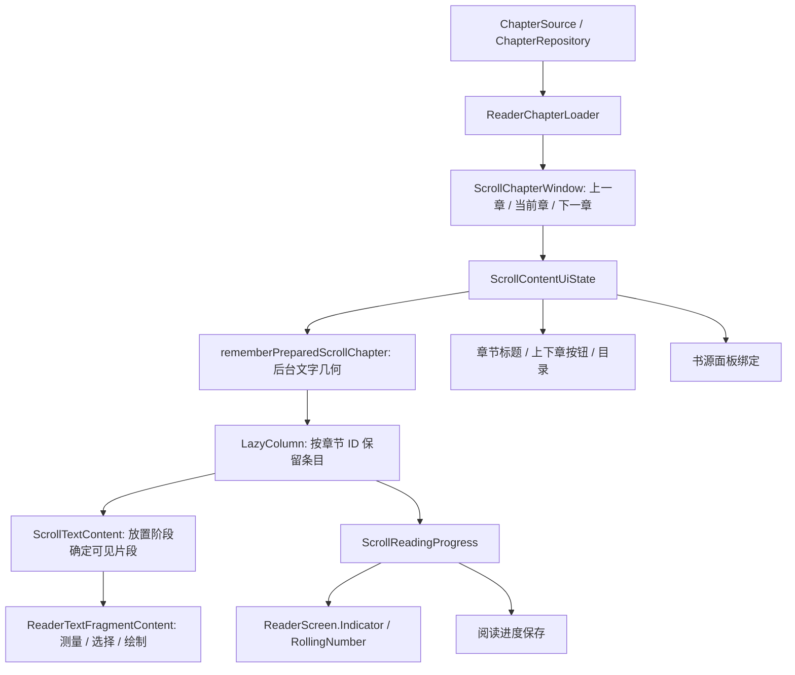

# 阅读页界面更新与性能排查

本文描述当前阅读页的状态归属、更新时序和排查边界。具体设备、书籍、录屏、探针、帧样本与对照结果留在仓库外；本文不把单次测量当作通用性能预算。

## 状态从哪里来



| 状态或结果 | 归属与消费位置 | 更新约束 |
| --- | --- | --- |
| 当前书籍、阅读模式、目录 | `ReaderViewModel` / `ReaderScreenUiState`；导航、正文和面板消费 | 阅读会话跟随导航入口；模式切换期间可能同时存在进入和退出的渲染器。 |
| 三章窗口、当前章节、`LazyListState` | `ScrollChapterWindow` / `ScrollContentUiState` | 连续跨章保留列表身份；显式跳章可新建列表并恢复位置。旧请求和旧槽位结果必须被身份检查拦截。 |
| 处理后的章节对象 | `ReaderChapterLoader` | 仅在书籍及完整处理后源数据相等时复用保留对象；标题、相邻章节或正文变化均不能按 ID 直接复用。 |
| 字体、行高、段距等排版输入 | `rememberReaderTextLayout` / `LocalReaderTextLayout` | 输入同时供正文、预览和分页使用；无关进度变化不能构造新的排版输入。 |
| 实际可用正文区域 | `resolveReaderBodyLayout` / `readerBodyGeometry` | 布局、分页和恢复位置使用相同像素尺寸；不能用全屏高度代替正文视口。 |
| 当前实际布局状态 | `LocalReaderLayoutResult` | 活跃渲染器在 `SideEffect` 中报告；设置页显示实际结果。当前实现按模式及章节内容重置状态容器，不可直接去掉重置而显示旧章布局。 |
| 章节片段几何 | `PreparedScrollChapter` / `ScrollTextLayout` | 后台准备；任务取消后不能发布旧输入结果。设置重排期间可暂时显示原几何，再通过原文锚点恢复。 |
| 阅读百分比 | `ScrollReadingProgress` | 滚动采样、显示更新和持久化具有不同节奏；停滚、离开页面及恢复屏障有单独处理。 |
| 原文位置、书签和朗读位置 | `ReaderPositionSession`、`ReaderBookmarkSession`、`ReaderSpeechFollow` | 使用章节身份和 UTF-16 原文锚点；旧渲染器不能完成新请求，也不能继续处理输入。 |

主要入口：[ReaderScreen.kt](../app/src/main/kotlin/indi/renakoni/nextvol/ui/book/reader/ReaderScreen.kt)、[Navigation.kt](../app/src/main/kotlin/indi/renakoni/nextvol/ui/book/reader/Navigation.kt)、[ScrollContentComponent.kt](../app/src/main/kotlin/indi/renakoni/nextvol/ui/book/reader/content/scroll/ScrollContentComponent.kt)。

## 一次滑动与一次跨章

普通章内滑动首先改变列表位置。`ScrollTextContent` 在放置阶段读取相对根布局的坐标，计算本帧可见片段，并在绘制前完成进入片段的组合和测量。窗口目前在可见范围两侧各保留一个片段；退出窗口的组合由 Compose 释放。不能从 `onGloballyPositioned` 写入可见范围、等下一帧再补正文，否则快速滚动会出现空白或上一帧文字。

跨章会在上述过程之外更新三章窗口：`ScrollChapterWindow.promoteAdjacent` 检查相邻章确已成功显示，保留原当前章，调整槽位，发布当前章节和进度，继续订阅章节及邻章。章节对象保留不等于 UI 节点常驻：上一章离开 LazyColumn 后，再进入时仍可能需要创建附近的文字节点。

同一主线程帧可以出现以下顺序：

1. `Recomposer:animation` 内的滚动推进触发布局、放置及新片段组合。
2. 章节窗口、标题、按钮和百分比的状态变化触发 `Recomposer:recompose`。
3. `Record View#draw()` 前的 `AndroidOwner:measureAndLayout` 处理新失效的布局，再绘制。

这能解释同帧两次 `AndroidOwner:measureAndLayout`，但不能只凭次数断言重复计算，也不能把两次调用直接等同于 lookahead / approach。预测布局是另外一层机制；需检查具体父子切片和输入变化。若要改变跨章发布时机或布局方式，必须重新验证当前帧文字、标题、进度、选择和恢复位置的一致性。

## 各类更新应落在哪一层

### 进度与指示器

`ScrollReadingProgress` 在滚动时记录有效位置，显示更新使用 120ms 的 `throttleLatest`；通常至少间隔 2500ms 才写持久化，完成阅读、停滚和显式保存另有处理。恢复期间的屏障及 revision 校验用于防止将重排当成阅读。不能为了帧率继续放慢保存或忽略停滚尾值。

指示器的百分比变化由 `RollingNumber` 动画显示。固定长度的数字提前建立保留位数，避免 `0 → 100` 与跨章同时创建两整列文字。它仍有首次组合、动画和布局成本。不要把固定数字控件的优化推广为整章 UI 常驻缓存。

### 当前章节与界面副作用

章节标题、上下章按钮、目录选中项需要跟随当前章节重组。书源面板绑定只需要观察章节，不需要让整个导航内容重组；`Navigation.kt` 在 `LaunchedEffect` 内通过 `snapshotFlow` 观察当前模式的章节 ID。观察也覆盖模式对象替换，书籍或会话替换则取消旧 effect。打开面板时仍立即绑定当前章节及进度，章节变化仍使旧面板上下文失效。

不要仅因为一个函数被调用就判定它昂贵，也不要把新建 data class 或 lambda 自动等同于所有子树失效。应先查看编译后的重组追踪、实际参数变化和子树是否被跳过。高层 `remember` 的键和 `LaunchedEffect` 的键同样可能读取快变状态，检查时不能只搜索 UI 文本。

### 设置、模式与布局有效性

字体、字号、段距、边距或视口变化需要新几何；颜色变化不应重做文字分页。翻页模式还要根据正文组件是否支持双页决定实际布局。

`Content` 的 `AnimatedContent` 负责阅读模式切换。`LocalReaderRendererActive`、位置会话、书签会话和音量键开关共同阻止退出渲染器处理新输入。不能为了降低组合次数去掉活跃身份判断。`LocalReaderLayoutResult` 的重置与翻页模式的 `AwaitingMeasurement` 防止设置页误报旧几何；稳定其容器身份之前，需要设计等价的有效性检查。

### 朗读、手势与选择

朗读索引由挂载章节按需准备，段落高亮和跟随使用原文范围。用户滚动、手动跳章或选择文字应取消跟随；暂停、面板覆盖、生命周期变化影响是否允许自动定位。

同一正文的可见片段共享 `ReaderTextSelection`，支持跨段选择。片段槽位必须标识实际几何和段落，当前为 `layout to index`。不同文字不能共用 `Unit` 槽位；不能缓存并跨布局轮次复用 `Placeable`。这些做法可能让进度继续推进而正文反复显示旧内容。

## 性能排查顺序

1. **固定场景。** 区分章内快速滑动、上跨章、下跨章、显式跳章；记录菜单/沉浸式、无痕设置、缓存状态、浮窗、字体、刷新率、温度、预热次数和手势时长。保留用户正在使用的通话或视频条件；不同条件的样本不要直接配对。
2. **先看干净构建。** 保存代码版本、APK、构建类型和真实编译状态。录屏与正式帧追踪分开采样，减少录屏引入的额外负载。只使用指定设备序列号。
3. **检查追踪完整性。** 验证 trace 起止、缓冲区覆盖/溢出、丢失事件和时间戳问题；缺失首段的环形缓冲区不能用于“尖峰消失”的结论。
4. **区分工作与等待。** 主线程 `Choreographer#doFrame` 墙钟时间包含阻塞和调度等待；通过 `sched` / `thread_state` 求实际 CPU 时间。绘制提交和屏幕呈现仍需 FrameTimeline；不能将主线程切片直接称为端到端触控延迟。
5. **关联具体工作。** 对照 `reader.prepare`、`reader.layout`、重组、文字节点测量及 `AndroidOwner:measureAndLayout` 的时间关系。网络请求在附近出现，并不证明它阻塞了该帧。
6. **必要时再加探针。** 统计进入片段、节点身份、内容输入和布局轮次；函数级 `CompositionTracer` 可临时桥接到 `android.os.Trace`。探针有开销，不能将带探针样本与干净 APK 的耗时直接比较，也不能记录用户正文进入仓库。
7. **同条件验证并检查正确性。** 除整体分布外单列跨章帧及异常帧；检查首帧文字、上下往返、长段落、跨段选择、标题/进度、设置重排与位置恢复。像素扫描只能排查整屏空白，不能证明完全没有闪烁。

### JIT 与编译状态

`Lock contention on Jit code cache` 是运行时锁等待。沿 owner tid 查找 JIT 线程的 `GarbageCollectCache`、`Code cache collection`、`RemoveUnmarkedCode`，再核对该线程的运行/等待状态。代码缓存回收与 Java 堆 GC 不应混为一谈；主线程在这段时间睡眠，也不等于在等待网络。

编译命令返回 `Success` 不代表目标 APK 获得了请求的 AOT 模式。支持 ART shell 的设备上可分别执行：

```sh
adb -s <serial> shell cmd package compile -m speed -f <package>
adb -s <serial> shell pm art dump <package>
```

检查实际 `status` 和 `reason`。调试构建可能仍为 `verify`，此时不能将它标为“Full / speed 已生效”。不要通过全局关闭 JIT、修改系统运行时参数或放宽帧预算掩盖问题。

非调试、相同代码与数据的诊断构建可用于隔离 debuggable / AOT 的影响，但未压缩的诊断 APK 不等于正式发布 APK；强制 `speed` 也不代表普通用户安装后的编译状态。正式发布性能需要单独检查冷/暖启动、实际优化构建及 profile 覆盖。是否投入 baseline profile 或更大界面重构，应由这些测量决定。

## 验证范围与继续优化的边界

优先运行与改动相应的局部测试：文字窗口和首次绘制见 `ScrollTextWindowTest` / `ScrollTextFirstDrawTest`，对象复用见 `ReaderChapterLoaderTest`，进度与恢复见 `ScrollProgressTimingTest` / `ScrollRestorationTest`，指示器见 `RollingNumberTest`，面板上下文见 `ReaderSourcePanelViewModelTest`。测试不能代替真机帧追踪，也不要在本地运行全量套件。

受控的渲染器基准及命令见 [Reader performance baselines](../tests/benchmark/READER_PERFORMANCE.md)。其 `readerBenchmark` 宿主涵盖真实 VM、仓库和正文渲染器，但没有完整的 MainActivity 导航和 ReaderScreen 工具栏更新路径；排查全阅读页重组需要补充完整应用样本。

以下改变需要另行证明收益和正确性，不能当作顺手收尾：整章 UI 缓存、取消预测布局、推迟当前章节发布、重写滚动容器、全局升级/替换 Compose。若剩余成本分散于新片段创建、合法章节更新和布局，先记录明确证据与未解决范围；不要用大范围重构换取未经验证的帧率承诺。
