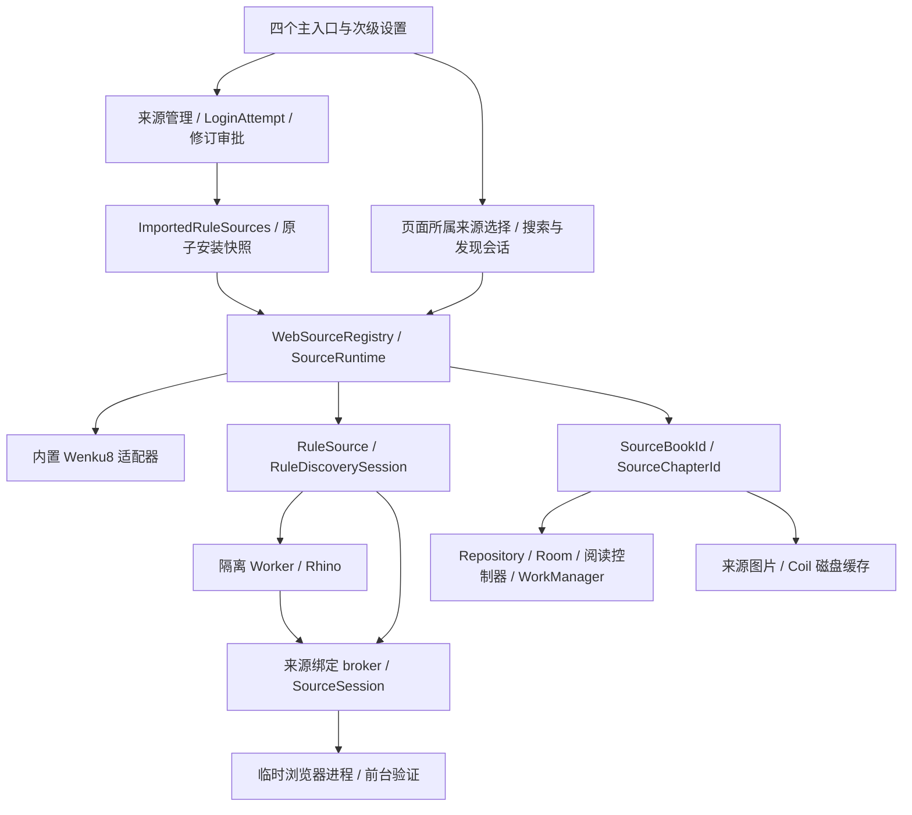

# VNR-23 多格式书源兼容与混合来源验收

对应 [#95](https://github.com/Renakoni/hnovel/issues/95)。本报告衔接已合并规则运行时、管理、修订、登录、浏览器和动态发现，以及 #79 → #80 → #81 的宿主收尾。它是当前交付边界；[早期 Rhino checkpoint](vnr-checkpoint-after-rhino.md) 保留为历史记录。

## 用户操作

1. 从阅读、书架、探索或分类右上角进入同一个设置页，打开书源管理。
2. 添加书源时按作者说明选择「标准阅读书源」或「扩展阅读书源」，再选择本地 JSON 文件、输入文件 URL 或粘贴 JSON。预览展示格式问题、未知字段及重复来源；选择新增或更新，并检查需要访问的站点后应用。预览本身不执行书源脚本。
3. 需要账号的来源在其详情页登录。静态表单、扩展动态表单、网页登录及图片验证码共用此来源的会话。表单中的按钮和选择控件可以执行来源动作；文本字段动作通过「执行字段动作」显式触发。关闭或取消当前登录会撤销该次尝试。
4. 探索、分类分别选择来源 Tab；搜索和列表展开继续使用入口携带的来源。仅支持搜索的来源可在来源管理中点「搜索此来源」。加入书架后的阅读和后台任务由书籍自己的来源身份决定。
5. 检查规则更新只产生候选版本，确认后才激活；也可导入新文件更新同一来源。失败保留旧版本，可以回退。修改书源显示名、账号或规则修订不改变书籍归属。
6. 退出账号或移除来源后仍可阅读已缓存内容。账号操作保留书架、目录、进度、计时、正文、图片、规则通用数据和资源；独立的「清理阅读缓存」操作才删除下载的正文与图片。未缓存的内容在来源不可用时明确失败。

导入预览支持新增/更新筛选、选择当前列表和清空选择，底部始终保留选择数量及确认操作。同一身份的多个候选需手动选择一个版本；筛选和批量选择仅修改草稿，确认时仍逐项验证权限和修订。导入提示可展开查看含义及字段名，不展示原始脚本或字段值。

来源列表的「已启用」仅说明启用状态。最近检查记录来自显式诊断，保留时间、阶段、结果、数量和对应修订/账号代次；发现目录与发现书单分别标明。记录不保存输入、URL、正文或凭据，取消的检查不覆盖上次结果。来源或账号变更后提示重新检查，一次未登录阶段检查不能证明其他阶段或已登录阅读可用。

## 格式与固定依据

| 来源种类 | 当前支持 | 依据及边界 |
| --- | --- | --- |
| 内置 Wenku8 | 原生搜索、书籍、目录、正文、探索榜单与标签分类 | `Wenku8Api` / `Wenku8Discovery`；宿主代码，不是规则沙箱。测试替换远端文档，不联系真实小说站点 |
| `legado-text-da17bb2` | 小说 JSON 单对象/数组、选择器、脚本、请求、登录、浏览器、发现及阅读流水线 | [hectorqin/legado 固定提交](https://github.com/hectorqin/legado/tree/da17bb2bed44f30b12a524c2457e32a20b16fa41)，Rhino 1.8.1；只对矩阵中指定的小说数据和交互契约负责 |
| `advanced-sample-20260908` | 上述小说链路及已确认动态发现、配置动作、脚本登录表单 | [Luoyacheng/legado 固定提交](https://github.com/Luoyacheng/legado/tree/8b87c5aba4df91c39a3a0939a68a1180b9f2ee1c) 提供扩展实现依据；profile ID 保留原标识，不等于整套 fork 的所有功能 |
| 未识别格式/API | 预览保留并报告未知字段；运行时未知规则/桥接明确失败 | 导入成功不能证明所有脚本可执行，不能自动认定未知方言兼容 |
| 两个已知 `.lnrp` 发布文件 | 本地选择原文件，以完整 SHA-256 映射到应用维护的小说 JSON 定义 | 见 [已知 LNRP 导入与在线验收](known-lnrp-import.md)；不安装或执行插件，未知包/版本明确拒绝；音频/漫画播放器不在范围内 |

标准登录表单是 JSON 数组。扩展模式额外允许 `@js:` / `<js>` 生成数组或 JSON 字符串，运行 `loginUrl` 中的帮助函数，以 `result` 传入当前表单值。支持 `default`、`chars`、`viewName` 和 text/password/button/toggle/select；`java.upLoginData` 更新当前草稿，`java.reLoginView` 请求重新计算表单。普通提交不重复执行表单生成脚本。默认值、提交值、行数、选项和输出都受限；未知行字段/类型提供 `loginUi[index].field` 位置。

表单声明缓存属于一次来源修订与账号运行时。UI 先创建新账号尝试再取表单，避免把旧凭据作为新账号默认值。服务在加载前后校验尝试的来源、代次和修订；取消加载会退役此尝试。Compose 只持有表单值与事件，不能调用引擎或决定执行身份。表单处理复用既有有界交互信封，不读取 `exploreUrl`，也不引入 Settings 框架。

登录里的 HTTP(S) 按钮和 `java.showBrowser` 通过现有浏览器端口打开并检查响应；登录 URL 自身是网页地址时，字段按钮仍使用自己的目标。失败的动作不发布 `upLoginData` 草稿。显式 Cookie、网络及 `source.put` 等操作仍遵循各自的提交语义，不承诺整段 JavaScript 事务回滚。

`java.getVerificationCode(imageUrl)` 依据固定参考 `JsExtensions.kt`、`SourceVerificationHelp.kt`、`VerificationCodeDialog.kt`：在当前来源的前台登录操作内获取图片、等待用户输入并返回非空原文。来源 headers、Cookie、站点授权、请求预算及撤销检查沿用 broker；后台调用报告需要前台交互。Android 在现有临时浏览器进程内显示图片与输入框，宿主页面嵌入已取回的图片并拒绝浏览器自动图标及其他子资源请求。输入不写入通用存储，源脚本收到返回值后自行处理。空输入、无效图片或取消不能变成成功验证码。

动态发现的完整有限动作协议和偏差见 [DISCOVERY.md](../source-content/DISCOVERY.md)。宿主拥有纵向布局；`style` 不作为任意布局程序执行。登录控件的长按协议、任意 fork 原生控件、其他阅读/书架事件总线不在已确认协议内。`upConfig` 的来源本地语义、主题/阅读设置快照和安装伪标识的差别继续明确保留。

## 分类接口核对

| 来源能力 | 取得目录和列表的方式 | 宿主行为 |
| --- | --- | --- |
| Wenku8 | `/modules/article/tags.php` 的标签链接；点击后按 GB2312 编码 `t` 参数加载标签列表，保留站点排序与宿主过滤 | 分类只取目录，点击才取书籍；探索保留首页和六个榜单入口，不把榜单页当成另一套分类接口 |
| 规则来源，有 `exploreUrl` 且启用发现 | 静态文本/JSON 或动态脚本目录，书籍由 `ruleExplore` 解析 | 复用同一目录协议供探索和分类；探索只预取第一个可打开目录的少量书籍，分类不预取正文 |
| 缺少 `exploreUrl` 或 `enabledExplore=false` | 没有声明可用发现接口 | 不加入探索/分类 Tab；搜索、直链和已有书籍读取按自身能力继续可用，不推断网站存在分类 API |
| 目录合法但为空 | 例如 `exploreUrl="[]"` | 保留来源能力，显示此来源空态 |
| 目录类型/字段错误、认证/网络失败 | 有能力但本次执行失败 | 显示该来源的对应错误与重试，不伪装为空目录或切到别的来源 |

这些状态分别由 `RuleDiscoveryProviderTest`、`Wenku8DiscoveryTest`、分类/探索 ViewModel 与 Compose 测试验证。无发现来源的搜索入口由 `SourcesScreenTest` 验证，混合来源验收同时检查其不会进入分类能力列表。

待讨论的产品选择：是否在分类空态进一步列出「只支持搜索」的已安装来源并提供快捷入口。当前版本遵循已确认的能力过滤规则，入口在来源管理；没有为不存在的接口生成统一分类或扫描全站标签。这个可见性选择不阻碍现有来源接入。

## 矩阵与验证归属

[coverage.json](../source-compatibility/src/test/resources/coverage.json) 保留全部 **33** 个必需能力族，逐项列出生产测试。VNR-23 核对后为 33 implemented：过期的 URL/HTTP/storage、Cookie/登录/浏览器/诊断/修订条目补齐已有生产证据；本次补上动态登录、验证码、组合验收与缺失的回归。没有把 required 项目改成 unsupported。

| 矩阵能力 | 主要生产所有者 | 可执行证据 |
| --- | --- | --- |
| FORMAT | `SourceDefinitionImporter` / store | `SourceDefinitionImporterTest`、`SourceImportDownloadTest`、参考模块的产品导入测试 |
| HTML / JSON / XPATH / REGEX / COMPOSITION / REPLACEMENT | `RuleEvaluator` / parser | 固定选择器差分及 `RuleEvaluatorTest`，包括参考缺陷的明确差别 |
| VARIABLES / JS / ENCODING / FILES | `source-rhino` / `SourceExecutionBroker` | Rhino 数据、DOM、响应、工具、资源测试与实际 Android archive/provider 测试 |
| URL / HTTP / COOKIE / STORAGE | `RequestCompiler` / `SourceSession` / broker | 真实本地 HTTP、headers、重定向、Cookie、限流、配额、TTL、取消、持久化及来源隔离测试 |
| LOGIN / EXTENSION-LOGIN-UI | `RuleSource` / `SourceLoginService` / `SourcesViewModel` | `RuleLoginFormTest`、`SourceLoginServiceTest`、表单 Compose 与账号加载取消测试 |
| WEBVIEW / WEBVIEW-ISOLATION | `AndroidSourceBrowser` / `SourceBrowserService` | **API 24/35** `SourceBrowserInstrumentedTest`：真实 Chromium、POST、验证码、Cookie、localStorage、Service Worker 与迟到回调 |
| SANDBOX / IDENTIFIERS | `ExecutionAuthority` / isolated executor | JVM 子进程、真实隔离 UID/Binder、失效/超时/恢复、受限安装标识测试 |
| SEARCH / DETAIL / TOC / CONTENT / IMAGES | `RuleSource` / source adapters / repositories / Coil | `RuleSourceTest`、`ImportedRuleSourcesTest`、`SourceImageTest` 与混合验收 |
| DISCOVERY / EXTENSION-FLAGS / EXTENSION-INFOMAP / EXTENSION-UI | `RuleDiscoverySession` / provider / page ViewModel | 目录、有限动作、未提交草稿、持久化、来源 Tab、搜索上下文与页面生命周期测试 |
| DIAGNOSTICS | `SourceDiagnostics` / `ContentTrace` | 真生产阶段执行、脱敏、匿名隔离、失败位置和取消测试，含动态登录表单 |
| REVISIONS | `SourceRevisionUpdates` / activation snapshot | 验证失败保留旧运行时、权限新增、原子提交、回退和删除竞态测试 |
| INTEGRATION | 共享宿主 Repository / Room / WorkManager / readers | `MixedSourceAcceptanceTest`、`HostMultiSourceIntegrationTest`、导航与两种阅读模式回归 |

完整 JVM CI 运行 app 和七个 source 模块。`CorpusIntegrityTest` 固定必需集合、检查状态与实现数量、验证每个引用的产品测试文件存在，并保留参考文件校验与错误用例。它只验证矩阵证据完整性，**不能证明被引用的 app/Android 测试已执行**；最终判断必须同时看 JVM 与 API 24/35 任务。PR 对 main 或前置功能分支都触发同一组检查，未增加 Release 工作流。

## 混合来源闭环

`MixedSourceAcceptanceTest` 使用真实 Wenku8 解析器、从文件添加的标准合成源和从文本添加的扩展合成源；两规则源共享 HTTP 站点与远端书籍 URL，分别登录合成账号。Wenku8 只替换远端文档和定时连通性检查，规则源通过真实 `WorkerRuntime → ExecutionWire → broker → 本地 HTTP` 执行。

- 三来源完成探索、分类、搜索、书架、缓存、阅读进度/计时与 EPUB 导出；校验来源限定身份和每本书的正文。
- 使用真实文件 Room、WorkManager 官方测试适配器及实际缓存/更新/导出 Worker；不是假数据库或只验证任务参数。
- 更新并回退标准源，保持书籍身份及账号；诊断扩展登录表单；增加远端目录章节后运行更新 Worker。
- 在 A 正在刷新时注销 A，验证请求返回来源不可用、B 保持登录；A 的规则通用数据、阅读记录与 Coil 磁盘图片保留。
- 重建注册、账号服务、已安装来源及 Room，使用生产账号代次存储重新读取状态；移除来源后不访问网络，实际翻页和滚动控制器都经 `ReaderChapterLoader` 与生产组件解码/构建读取原缓存。

组件依赖中的用户设置使用受控测试值，不涉及真实账号。此闭环证明生产数据与控制器接线；Compose 布局/导航、文本分页、计时和手势由各自回归验证，浏览器/进程隔离由真实 Android 任务验证。没有把 Robolectric 称为真机或 Chromium 测试，也没有验证外部小说站点在当前网络上的可用性。

## 诊断

来源详情的诊断页可单独测试搜索、详情、目录、正文、发现目录/列表和登录表单。报告包含不透明来源 ID、profile、修订摘要、账号代次、阶段、规则字段、结果码、计数与有界事件，不输出 Cookie、Authorization、查询正文、验证码、脚本抛出的原始秘密或完整响应。

首次执行缺少固定 Java 互操作绑定时，报告 `UnsupportedDependency`、具体依赖与字段（共享库为 `jsLib`），并给出当前 profile 和规则改写方向。可导入不等于已可搜索或阅读；复杂番茄原文件的后续兼容仍由 #134 追踪。

诊断使用安装来源的网络授权和独立临时匿名状态；不会复制用户登录，也不写入正常来源配置。来源在执行期间更新、注销或移除会取消诊断。需要账号的站点可能在匿名诊断中报告登录/权限要求，这与已经登录的正常阅读是否成功是不同观察。不要用诊断按钮再次提交正式登录。

## 架构所有权

执行票据含来源、profile、修订、账号代次及 nonce；页面选择不签发账号权限，书籍身份不含账号、修订、书名或作者。退役运行时撤销其请求，离线读取依然属于原书籍。身份、导航及宿主入口更详细的责任表见 [host-multi-source.md](host-multi-source.md) 与 [source-browsing.md](source-browsing.md)。账号与本地内容以 [用户确认的账号语义](account-switch-semantics.md) 为准。

## 验证记录

本机运行完整 JVM/宿主任务及 debug、Android test APK 构建；命令与具体数量记录于本项 PR。浏览器和隔离进程的 API 24/35 结果以同一 PR 的 CI 链接为准。PR #127 早期 API 35 曾在测试宿主 accessibility 文本等待处超时，发生在登录请求之前；本次改为 `ActivityScenario` 等待真实 RESUMED 生命周期并自动销毁宿主，实际跨进程输入/完成按钮仍保留断言。

Google Maven 本机 TLS 曾导致新增 WorkManager 测试依赖解析失败，使用工作区外的临时 Gradle init script 缓存同一坐标后离线验证；未改仓库依赖源，CI 使用仓库标准配置。外部站点、私有 JSON/`.lnrp` 与真实账号没有参与测试。
