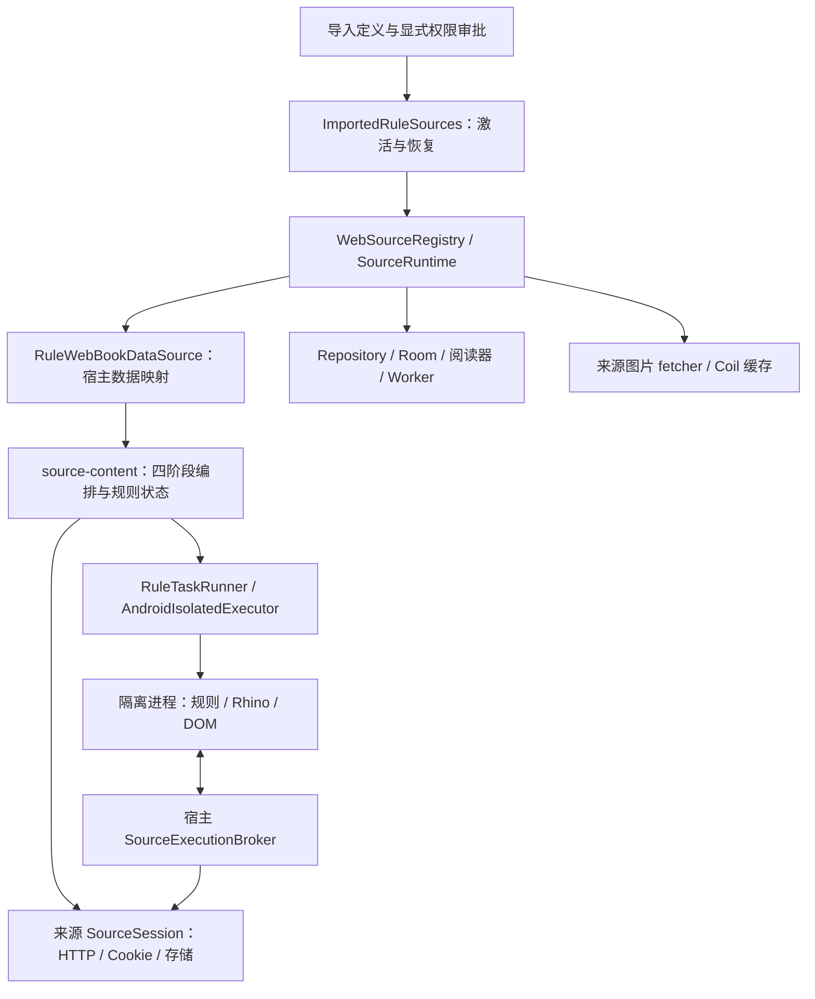

# VNR checkpoint：Rhino / 隔离执行合并后的生产连接

> 历史阶段报告：下面保留 2026-09-10 当时的发现和待办，不代表当前功能状态。登录、浏览器、修订、来源管理及宿主入口的后续交付见 [VNR-23 当前验收](source-compatibility-acceptance.md)。其中图片按账号隔离、book/chapter 存入 Account 区的早期设计已被 [用户确认的账号语义](account-switch-semantics.md) 取代：账号操作仅撤销认证，来源的阅读内容、图片与通用数据保留。

核对日期：2026-09-10。审查基线：main `bd49433d`，其中 #108 对应 `bd49433d`，#113 对应 `0fab354a`。参照 VNR 规划、书源研究文档、#90 原始职责与固定 Legado `da17bb2bed44f30b12a524c2457e32a20b16fa41`。本次 PR 只关闭 #90；本报告同时记录下一批之前的独立检查结论。

## 结论与证据层级

#108 和 #113 已提供可连接的解释器、响应/实体视图、执行身份及 Android broker IPC。合并基线尚未把导入定义接入宿主读书流程：旧 `SourceContentPipeline` 没有生产 executor 或调用者，其测试使用假的 executor。因而“规则/隔离模块通过”与“导入后能读书”之间仍有实际缺口。

本次接入后，服务可以导入、审批来源权限、激活、搜索、读取详情/多页目录/多页正文、解码图片，并通过现有 Repository、Room、缓存 Worker 和内容组件读取离线副本。应用启动恢复的是已审批的定义快照，导入或列举定义本身不执行脚本、不自动授予网络权限。

这仍不代表普通用户已能在正式 UI 完成整个添加流程，也不代表私有复杂来源或完整浏览器规则已经兼容。管理 UI、来源 Tab、登录界面、WebView 和修订更新仍有明确的独立工作，见后表。

## 本轮发现并处理的连接问题

| 编号 | 触发与影响 | 处理与验证入口 |
| --- | --- | --- |
| CP-01 / P1 | 导入存储、规则解释器和宿主数据源没有生产连接；仅有假的流水线测试 | 新增 `source-content` 与 `ImportedRuleSources` / `RuleWebBookDataSource`，用真实 worker、broker、本地 HTTP、Room 和 CacheBookWork 贯通 |
| CP-02 / P1 | 规则图片若沿用直接 Coil HTTP，会跳过来源请求编译、Cookie 与图片解码 | 可选 `SourceImageProvider` 输出解码后的字节；实际请求仍经过来源 broker。查看、保存、封面和导出显式传递图片角色 |
| CP-03 / P2 | 选出的 HTML 节点序列化后再解析为 document，节点自身属性及 table/tr 上下文丢失 | `RuleValue.Node.parentTag` 保留片段上下文，规则选择器与 Rhino DOM 复用同一重建函数；table 行与分卷测试 |
| CP-04 / P1 | 账号代次只在内存；重建服务可能再次打开旧账号存储空间；发 ticket 与退出之间也有竞态 | 持久化单调代次；创建/发布运行时与 begin/logout 使用同一账号锁。账号变化立即撤销旧 ticket，再重建对应注册 |
| CP-05 / P1 | 新流水线在宿主优先级调度器的单名额请求内创建超时子任务，子任务等待父请求占用的名额 | 真实 Room 服务测试复现挂起。规则编排和文件操作固定在 IO 上下文，外层请求继续保留宿主优先级 |
| CP-06 / P2 | 移除来源后，仅把请求改成 opaque key 能阻止 HTTP 回落，却不能保证读取 Coil 磁盘图片 | 专用 fetcher 在无 runtime 时只读指定磁盘条目，未命中明确失败；实际 Coil 测试覆盖清空内存、磁盘命中与未命中 |
| CP-07 / P2 | 不同书籍可共用图片 URL，封面与插画也可共用 URL，但解码依赖 book/角色 | 图片 key 纳入来源、书籍 remote ID、角色、修订、账号代次、URL 和 headers；可见入口及保存/导出保持同一角色 |
| CP-08 / P2 | 部分规则源只有最新章节或目录，无法直接提供宿主需要的更新时间 | 持久化“观察到内容变化”的时间；比较更新字段，缺少字段时比较目录身份。相同刷新不制造更新 |
| CP-09 / P2 | 只缓存正文 JSON 会留下未加载图片，离线章节仍有缺图 | CacheBookWork 使用同一来源图片接口缓存插画和封面；Room 服务测试移除来源后验证图片磁盘读取 |
| CP-10 / P1 | 无 jsLib 时每个字段都冷启动 Android worker；API 35 首次类加载超过 5 秒，尚未执行规则即失败，长目录还会反复消耗启动成本 | 成功调用复用进程，无库调用仍使用独立 JS realm；启动独立限时 15 秒，执行仍限时 5 秒。撤销、失败、取消和进程死亡保留销毁路径；真实 Binder 测试覆盖延迟连接、连续调用及失效重建 |

实现过程中还按固定参考纠正了两个 hook 契约：`loginCheckJs` 接收并返回 StrResponse 视图，可返回 `java.connect` 的替代响应；`formatJs` 的 `gInt` 在整份目录中继承，`index` 为一基下标。错误返回类型明确失败。请求准备和响应视图复用 #108 的实现，不在宿主复制一套 JS 引擎。

## 责任与身份所有权

| 对象 | 稳定身份 / 所有者 | 生命周期语义 |
| --- | --- | --- |
| 书籍、章节、书架、进度 | 宿主 `SourceBookId(sourceId, remoteId)` / `SourceChapterId` | 相同书名、作者甚至相同远端 URL，只要来源不同，就是两本书。修订和账号不是书籍主键 |
| 已激活定义 | `ImportedRuleSources` 的原子快照 | 初次审批先落盘再发布注册；待导入修订不会隐式替换运行版本。更新/回退属于 #94 |
| 执行 | 共享 `ExecutionAuthority` 签发的 namespace/source/profile/revision/account/nonce | 来源撤销或账号变化后，迟到的规则结果、状态写入和网络提交不能获得新授权 |
| book/chapter 变量及目录 | `RuleBookStore`，broker 的 Account 区 | 来源/profile/账号隔离；解析成功后按书籍原子写入快照，跨多本搜索结果不承诺数据库事务。显式 `source.put` / Cookie / cache 操作遵循 broker 自己的提交语义，不承诺整段 JS 事务回滚 |
| 可读正文、书架、阅读进度 | 既有 Repository / Room | 缓存先返回；远端失败不把已有正文替换为空成功。移除来源保留本地可读内容 |
| 图片 | broker 请求和隔离解码；宿主 Coil 缓存 | 解码角色显式传递。同账号下移除来源可读最后成功记录的缓存，磁盘未命中不能回落到 HTTP；账号变更后拒绝旧账号图片缓存，读取前后均检查代次 |

## 设计原则检查

| 原则 | 本轮判断 |
| --- | --- |
| 高内聚、低耦合 | 四阶段业务集中于 `source-content`，通过一个执行端口调用隔离层；它不依赖 Android UI、Room、Coil 或插件管理器。Android 适配器只把结果转换为现有宿主模型 |
| 单一职责 | `RuleEvaluation` 管执行帧和返回状态；`RuleBookStore` 管规则状态持久化；`RuleSource` 管阶段顺序与分页；激活服务管注册生命周期；图片 fetcher 管图片字节/磁盘。没有第二套阅读器或数据库 |
| 有用的开放/封闭 | `RuleTaskRunner` 允许 JVM 和真实 Android 使用相同编排；可选 `SourceImageProvider` 让规则图片接入，原生数据源无需实现空方法。后续 WebView/动态发现按其 issue 接入，不提前添加通用插件机制 |
| KISS | 初次激活仅保存已审批快照与 grants，拒绝把替换修订伪装成初次激活；没有 Settings 框架、来源商店、更新策略层或新的阅读模型 |
| DRY | 删除无人调用的旧流水线及 fake executor 测试，以真实流水线覆盖替换；共用请求模板、响应快照、HTML 节点重建和来源图片入口。局部清晰的字段映射保留在各阶段 |

`RuleSource` 的四阶段位于同一类，目前状态交接紧密，继续拆成多个互相传递可变上下文的服务不会降低耦合。后续扩展应优先保持纯数据边界，不能让来源规则访问 Repository 或读取当前浏览 Tab。现有优先级调度器对任意嵌套 Job 的通用支持仍不是本 PR 的交付；本次通过明确执行上下文避免该问题，通用调度器改造需单独有调用证据。

## 仍需独立收敛的部分

| 所属 issue | 当前真实边界 | 下一步验收 |
| --- | --- | --- |
| #88 | 有账号/Cookie 状态与 broker，当前没有完整生产登录交互。issue 已关闭不能作为功能已交付的证据 | 补回登录字段、表单/脚本、Cookie 与浏览器账号切换的实际流程；建议恢复跟踪 |
| #89 | `BrowserSessionRegistry` / `BrowserRequestPolicy` 是状态与策略，没有实际 WebView 规则执行入口 | Chromium 下验证导航、子资源、Cookie/localStorage/Service Worker 隔离；当前流水线明确报 BrowserRequired。建议恢复跟踪 |
| #94 | 初次激活可恢复；尚无验证新版本后替换旧版本及失败回退的产品流程 | 在本次已审批快照之上实现 staged revision → 校验 → 原子替换；不能直接打开导入库中的最新版 |
| #78 / #79 / #80 / #81 | 来源感知的读书路径与旧浏览/全局换源 UI 并存 | 来源 Tab 与搜索状态、设置入口、退役清库换源流程；当前浏览页面不是本次服务测试的驱动入口 |
| #91 / #92 / #93 | 规则发现、管理 UI、生产诊断尚未闭环 | 复用本次激活、执行与错误入口，分别完成交互；不要再构建假的平行服务 |
| #95 | 各模块/合成链路通过不等于整个目标兼容矩阵通过 | 汇合真实浏览器、管理与修订流程后验收；私有来源没有在本轮联网执行 |
| #68 / #71 / #72 | 下载持久化、导出稳定性和 EPUB 合规是已存在的独立产品任务 | 本次只保证来源/图片接口衔接，不能据此声称这些 issue 已修复 |

另有一个独立的一致性发现：`Wenku8Api.kt` 的原生 Ktor 日志仍输出完整 Cookie，请求启动日志已实际观察到该行为。规则 broker 的脱敏边界不能覆盖这条原生链路；建议 #93 将原生网络日志一并纳入 Cookie/Authorization 脱敏验收。此报告不复制 Cookie 值，也不将原生账号流程改造算入 #90。

## 资源与有意边界

来源表达式、正则、DOM 和图片解码在 worker 内执行；宿主只编排有界数据。一次编排最多 60 秒，单次 worker 执行 5 秒、结果 192 KiB；Android 冷启动另外最多等待 15 秒，仍计入整次编排的 60 秒期限，启动期间也响应撤销和取消。成功执行复用进程，普通调用不保留 JS 全局变量，jsLib 按既有来源/修订/账号所有权保留；失败或失效后不得复用。Android wire 保持既有 256 KiB 上限。每个求值阶段及其行分支共享 4096 次调用预算，目录/正文最多 64 页，搜索页最多 1000 条、目录最多 5000 条、合并正文最多 512000 字符；这些是上界，不保证同时到达全部上界。网络、存储和脚本 bridge 的原有更小配额仍生效，超出明确失败。

`ruleContent.parts` 使用独立的 `ExecutionTask.ContentMarkup`，在 worker 内直接按 DOM 顺序生成文本/图片数据，最多遍历 16,384 个节点、深度 64；不再通过可信 JS 反复包装 DOM，也不执行书源 jsLib。段落、换行、图片位置和相对地址解析责任不变；正文提取/替换仍走原有规则执行，宿主继续负责图片 URL 归一化和阅读组件映射。转换与普通规则共享撤销、取消、调用次数和诊断边界，失败不会提交前面阶段的局部状态。

图片以有界数值字节数组进入解码脚本，使用紧凑 JSON 传输；可解码大小受展开后的结果和 wire 配额限制，未实现无界大图 IPC。普通无解码图片不经过数组展开。图片的源内状态可能依赖书籍，因此不能只用 URL 作缓存身份。原生数据源仍是宿主代码，不能因为共用接口而称其为沙箱代码。

文件/音频/漫画来源类型不在此小说流水线中启用；浏览器字段需要 #89；登录和动态交互需要 #88/#91。章节主键采用目录给出的逻辑 URL（含请求选项），正文后续分页 URL 只用于取页，不改变进度主键。重复整页/循环目录明确失败，正常边界章节重叠按固定参考保留最后一项。

## 可复核的验证

- `RuleSourceTest`：真实 importer、WorkerRuntime、ExecutionWire、broker 和本地 HTTP；同名跨源、直链及 bookUrlPattern、请求参数、分卷/多页/重复页、正文替换/图片顺序、响应 hook、共享目录格式状态、取消/撤销、更新标记、紧凑图片字节传输。
- `ImportedRuleSourcesTest`：实际生产激活服务、注册表、Repository、Room、CacheBookWork、Coil 磁盘缓存；两个同名同作者同 URL 来源共存，移除后的离线正文/图片、启动恢复、账号代次及损坏快照。
- `SourceImageTest`：真实 Coil 请求链中的来源/书籍/角色/账号/修订缓存隔离，移除来源后磁盘命中与禁止网络回落。
- `IsolatedExecutionInstrumentedTest.importedRulePipelineReachesReadingAcrossRealBinder`：真实 Android 隔离进程执行合成流水线；沿用现有 API 24/35 CI 任务。
- `IsolatedExecutionInstrumentedTest.coldStartupIsBoundedSeparatelyAndSuccessfulCallsReuseTheWorker`：延迟连接超过执行期限仍可启动；连续无库调用只绑定一次，JS 变量不跨调用，撤销与脚本失败均触发重建。
- 既有规则、Rhino、执行、网络、导入、兼容语料、Room/Worker、两种阅读模式及导出宿主测试继续作为回归门槛。JVM、Robolectric 和真实 Android 结果分开记录，不以测试数替代场景证明。

阶段的 60 秒期限从取得来源串行操作锁后开始，覆盖 worker 队列及冷启动；等候前一个来源操作期间响应调用者取消，但不计入这项阶段期限。

本轮完整 JVM/宿主回归与 debug/test APK 构建通过。最终实际 Android 隔离测试类在 API 24、35 各执行 25 项，全部通过；首次 API 35 冷启动超时已由 CP-10 修复及新增回归覆盖。详细命令在 PR 验证段记录。
