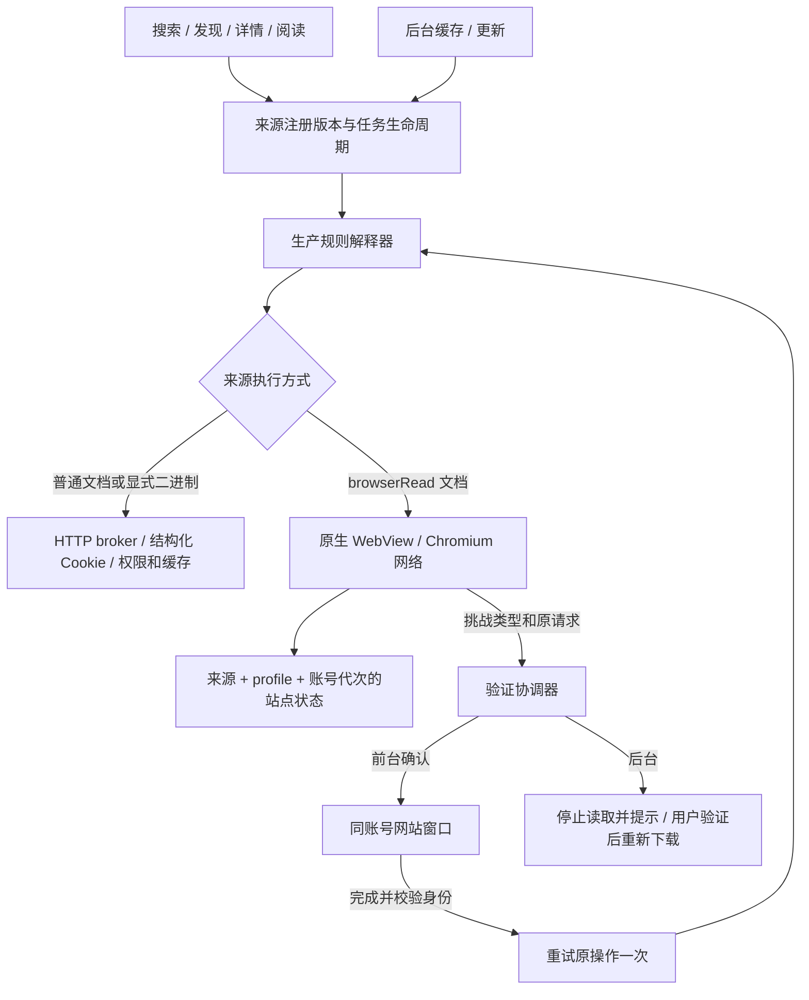

# 浏览器方案：职责、Chromix 思路与实施验收

更新：2026-09-14。本文是当前实施设计；[README](README.md) 保存已完成的设备证据。
Chromix 是桌面参考，本项目借鉴它的一致性约束和验收方法，不把桌面 persona 参数当成 Android 配置。

## 产品目标与成功标准

普通 HTML/API 来源用 HTTP；需要登录、验证和动态页面的来源可持续使用原生 WebView。
成功标准是搜索、发现、详情、目录、正文和后台下载能够保留自己的账号，遇到验证可明确恢复，取消或账号变更后旧结果不提交。
“本次 CF 通过”“Cookie 仍在”“长期验证频率下降”分别需要证据。三者不能互相替代。

## 组件与数据流

| 组件 | 负责 | 边界 |
|---|---|---|
| ImportedRuleSources / ExecutionAuthority | 来源定义版本、授权、账号代次、撤销 | 定义里的网址和脚本不能指定其他账号的状态目录 |
| HTTP broker | 原始状态/头/协议、逐请求权限、HTTP Cookie jar、缓存 | 不接管已进入 Chromium 的网页子请求 |
| NativeSourceBrowser | 原生入口准入、独立进程、串行、结果所有权和取消 | 不把 WebView 的安全模型说成 broker 的逐对端检查 |
| NativeBrowserFiles | 进程停止后的目录归属和切换 | 不复制运行中的 SQLite；进程级状态不等于独立 persona |
| NativeSourceBrowserService | 页面原生网络、脚本、iframe/Worker、DOM 提取 | 不注入特权页面桥；不改写 fetch/Cookie；拒绝错误证书 |
| RuleSource / RuleEvaluation | 解析、预算、把失败转换为与当前来源绑定的验证操作 | 验证等待在解析预算之外；不让脚本构造恢复权限 |
| SourceVerificationCoordinator | 前台确认、队列、账号/版本校验、一次重试、后台提示 | 不实现浏览器网络、账号切换或来源限速 |
| UI entry / ForegroundSourceRequest | 授予本次用户操作交互能力；离开页面时取消 | High 请求优先级、App 恰好在前台，都不自动赋予后台任务交互权 |

## 验证恢复契约

1. 原生后台导航识别 Cloudflare、站内验证或登录页，返回稳定类型与宿主保留的原始请求。
2. RuleSource 为该失败生成不公开 URL/头的恢复操作，闭包绑定当前来源的 authority、session 和请求。规则内 java.connect 的失败也保持该信息。
3. 前台调用者等待“验证并继续”；实际窗口仍使用原始请求的账号。等待不占用一次规则解析的 30/60 秒预算。
4. 用户完成后，窗口返回 DOM；宿主再次检查版本/账号有效性，然后重试原业务操作一次。仍被挑战则返回错误，不自动循环。
5. 用户取消、离开导航入口、移除/禁用来源、换定义或换账号，原任务失效。验证 Activity 覆盖原入口时保留其任务；返回原入口后继续。
6. 后台任务返回需要验证的错误并停止，不开 Activity、不 Result.retry 循环。App 提示验证入口；下载页显示需要验证，完成后用户重新发起下载。后台任务的原 WorkManager 实例不自动复活。

当前请求共用去重层会脱离原调用者生命周期；前台交互请求暂时绕过该层，保留其独立取消语义。普通后台请求仍去重。
此取舍用独立取消和前后台同键并发测试约束；不能把后台共享任务升级成前台任务。发现按钮脚本可能写入状态或执行其他动作，不进入自动重放；列表/目录/正文恢复以重新执行一次读取为边界。

## Chromix 思路映射

参考固定于 `ref/Chromix` 的 `1222eec`（Chromium 152.0.7977.82）。下表中的“采用”不表示全部实测完成。

| 领域与源码线索 | 思路 | Android 决策 / 当前状态 | 验收方式 |
|---|---|---|---|
| 0002/0003 UxrConfig，0005–0009 renderer 初始化 | 配置先校验、启动后稳定，子进程看到同一身份 | 采用稳定 provider 原生身份和来源状态归属；不实现桌面随机 persona | 记录 provider/version、跨任务/重启结果；账号切换测试 |
| 0004 user_agent_utils，0036 启动规范化 | 浏览器品牌、内核版本、JS UA 和请求头必须合理对应 | hlib 使用 getWebViewUA；显式其他 UA 仍是源兼容选项，需要单独验收。MuMu WebView 110 不支持 USER_AGENT_METADATA | 同页面 echo 请求头与 window/frame/Worker UA 对照；缺失 CH 如实记录 |
| 0011–0017 navigator，worker 探针 | 不能只修改主页面的属性 | 原生页面不做 navigator getter 注入；扩展探针到同源/跨源 frame、dedicated/shared Worker | 对照同设备 native/MD3；Worker 不具备的 window 属性不判为缺陷 |
| 0018、0125–0128 display backend | screen、viewport、DPR、CSS 与实际布局对应 | 使用真实 Android 布局；前后台 WebView 尚需独立测量，不能仅伪造 innerWidth | 中性页面记录 screen/window/visualViewport/visibility；旋转前后测试 |
| 0019 timezone、Intl 与 locale 探针 | 时间和语言来自同一环境，不能只改一个 getter | 保留系统时区/语言；网络出口地区不自动决定语言 | window/frame/Worker Intl 与语言比较，记录 App 语言和系统语言差异 |
| 0020/0031 Canvas 与导出审计 | 像素、alpha、导出、重复读取遵守图像契约 | 保留 WebView 实际渲染，不添加随机噪声 | 固定几何图像的重复像素、边界透明值、跨 realm 比较；完整 codec/ICC 矩阵仍待扩展 |
| 0101/0102/0147 WebGL | renderer 名称必须与实际绘图上下文相符；软件上下文不能冒充硬件 | 保留原生 GL 信息；MuMu 报 Adreno 不视为物理 GPU 证明 | 除 vendor/renderer 外测 clear/readPixels、limits、errors |
| 0148 WebGPU / Dawn | WebGL 和 WebGPU 可能选择不同设备，不强行统一名称 | 保留实际 adapter；WebView 110 缺失能力就记录缺失 | 有 API 时测 adapter/features/limits；不填造设备值 |
| 0026–0028 Audio、字体/媒体探针 | 报告的能力要有可执行的后端 | 使用系统媒体/字体；设备权限按产品需求拒绝 | OfflineAudio、字体度量、权限状态属于后续覆盖；不安装伪字体/声音列表 |
| 0129 quota、0130 third-party Cookie | 配额/第三方 Cookie 是实际后端策略，不能仅改 JS 返回值 | 原生 CookieManager 与站点存储；需要的第三方 Cookie 在来源浏览器中开启 | HttpOnly、SameSite、第三方 iframe、退出清理与实际存储写入；quota 数字不固定造值 |
| 0139–0145 WebRTC | SDP 展示、实际 STUN/路由和配置不能互相矛盾 | 暂无 WebRTC IP 改写；媒体权限拒绝不等于禁用所有 ICE 网络 | WebRTC/STUN/TURN 与出口对照未完成，不声称无泄漏 |
| fingerprint_transport_audit / fingerprint_protocols | 在服务端观察真实 ClientHello/H2，而非根据 UA 猜测 | 移植自有回环端点的测量方法；原生与 HTTP 分开采样 | 记录 TLS/ALPN/H2 SETTINGS/伪首部；GREASE 与随机扩展顺序正常化但不删除真实差异 |
| fingerprint_acceptance / FINGERPRINT_STATUS | 源码、构建、浏览器运行和真机证据分开 | 每条结论写 provider、设备、入口、成功/失败/跳过 | MuMu 不替代真机，普通 Chrome 不替代 Chromix，单测不替代网站验收 |

Chromix 本身也记录了未完成的匹配原生构建、物理设备与部分全套检查。因此它提供设计和验证方法，不能作为“这些补丁一定能通过 CF”的依据。

## Cookie 与网络的选择

浏览器路径以 CookieManager 为权威，HTTP 路径以结构化 jar 为权威。第一版不借用桌面 Chrome Cookie，不展平属性再同步回 Chromium。
账号 Cookie、cf_clearance、站内验证 Cookie 可能有不同寿命与服务端约束。保留存储不会强制服务端接受旧令牌。
页面 iframe/fetch/Worker 使用 Chromium 原生 TLS/HTTP2。图片/二进制仍可能通过 HTTP，受登录保护的图片必须单独验证，不能从正文成功推断图片成功。

目录重定位支持取决于 provider，不只取决于 Android API。当前 MuMu 使用 API28+ 固定 suffix 的停进程/目录切换方案；API24–27 缺少重定位能力时明确不提供原生账号隔离路径。
普通 Android WebView 的 public API 不提供 Blink/GPU/Network Service 任意补丁点。当前工程不需要桌面随机设备模板，也不需要在阅读器内建设自编译内核分发体系。

## 实施顺序与完成定义

| 阶段 | 具体产物 | 完成定义 | 状态 |
|---|---|---|---|
| 原生基础 | PR #187：原生网络、持续账号、隔离、DOM 响应类型 | 单测、MuMu、实站读取、参考 App 对照 | 代码已提交；已跑通实站，记录过验证复发；远端检查见 PR |
| 验证恢复 | 本分支代码、前台 UI、后台提示、导航/账号取消 | 可控本地挑战完整恢复；真实 hlib 一次用户操作继续读取；多来源不串回 | 8 项协调器单测、确切请求/过期来源规则测试、MuMu 界面重建→验证→Cookie→原搜索均通过；实站待人工完成本次挑战 |
| 一致性探针 | realm-probe / consistency-probe，原生前后台与 MD3 后台数据 | 每项记录实值、缺失与异常；定位宿主引入的差异 | 已采集并修复真实布局，保留未验证领域 |
| 传输对照 | 自有 TLS/H2 fixture 与同设备请求记录 | 能区分 Chromium 和 HTTP 引擎；记录信任配置与完整握手范围 | 原生前后台及 Android OkHttp 已采集；外部线路/QUIC 不在回环证明范围 |
| 来源节奏 | 原生导航与 HTTP 来源请求的速率实现 | concurrentRate 真正执行、取消不补发、延迟后不突发 | 尚未实现；串行不等于 1/2000 |
| 平台与长时回归 | 新 provider、真实 Android、资源与验证频率统计 | 同一条件下多次登录/冷启动/切账号/读取；保留失败次数 | 尚未完成 |

首页仍按已确定的“榜单、文章入口；标签为分类”执行，章节标签不增加模型。首页/分类 UI 映射属于另一条改动，不混入验证恢复 PR。

## 本轮实测记录规则

2026-09-14 新增可复核数据：[realm 和布局](consistency-results.json)、[TLS/H2](transport-results.json)。数据来自中性自有页面，没有实站 Cookie 值或内容。

本分支最终 JVM 回归 831 项通过：app 418，七个 source 模块共 413，无失败或跳过。MuMu 原生/环境/HTTP 传输组 11 项通过、1 个未显式启用的环境探针跳过；生产验证窗口重建及原搜索恢复另 1 项通过。首次全量运行发现详情重试先返回旧状态的竞态，现已把 loading 清空放在发起任务时，修正后全 app 回归通过。新增窗口测试已纳入 API 35 CI；远端新结果以接续 PR 为准。

实站通过生产注册表、真实导入源与协调器到达“验证并继续”，点击后打开该账号的 hlib CF 页面；目前等待用户完成本次验证，未把这一步写成搜索恢复通过。此前 #187 的完整实站读取仍只是基线。

| 检查 | 实测 | 实施含义 |
|---|---|---|
| 后台布局 | 我们和 MD3 基线均为 0×0，scale 0.25；修正后为 1098×618，scale 1 | 在导航前对真实 WebView measure/layout，CSS 50vw 与实际尺寸有设备断言；不覆盖 innerWidth getter |
| 前台布局 | 1098×546，scale 1；高度差来自状态栏/工具栏 | 不要求后台假装拥有相同的可见窗口；焦点仍按平台报告 |
| UA/locale/realm | window、同源/跨源 frame、dedicated Worker UA 相同；本设备中文和 Asia/Shanghai | 跨 origin iframe 不等于已证明 OOPIF；CH、SharedWorker、WebGPU 缺失记录为平台能力 |
| Canvas | 各 realm 重复读取稳定、边界透明；前台 Worker 混色蓝通道 101，页面为 100 | 实测为 1 个通道的 1 级差，符合需要继续检查后端舍入的情形；尚未证明具体 GPU/Skia 路径，不强行让所有哈希相同 |
| WebGL | 实际 clear/readPixels `[64,127,191,255]`，error 0，报告 Adreno 640 | 确认可执行绘制；不把模拟器的 renderer 字符串当成物理显卡证据 |
| 原生前后台 TLS | 4 个 ClientHello 规范化后一致，TLS 1.3、ALPN h2、H2 SETTINGS/伪首部顺序一致 | 没有证据要求为前后台添加不同 TLS persona；调试证书例外仅用于隔离的中性 profile，生产仍拒绝坏证书 |
| Android OkHttp 对照 | H2 窗口 16777216，原生为 6291456；伪首部顺序与 TLS 列表均有差异 | 改 UA 或复制 Cookie 不会把 OkHttp 变成 Chromium；测试为相同依赖的 Android 客户端，独立 fixture CA，不是 broker 全权限路径验收 |
| X-Requested-With | 旧 provider 发出 App 包名；feature 查询 true，空 allow-list 实验后头仍在 | 当前 AndroidX 文档说明旧 API 已失效。已移除无效设置代码；应以新 provider 实测评估，不能宣称消除此头 |

网络数据的区别很具体：Chromium 伪首部为 `:method,:authority,:scheme,:path`；Android OkHttp 为 `:method,:path,:authority,:scheme`。这不是风控分数，只用于防止把两套网络栈误当成同一种环境。HTTP 自有 CA 与原生 CDP 证书例外均未改变系统信任库。

桌面 Chrome 本轮 9222 HTTP 调试入口不可用，未覆盖旧的 Chrome 153 对照数据。参考 MD3 本轮中性探针成功，额外 hlib 读取在搜索阶段等待 5 分钟未完成；超时已保留，不能用此前成功日志替代本轮结果。

仍未覆盖：新 provider/真实 Android 的同条件对照、外部线路与 QUIC、TLS 恢复、完整字体/Audio/WebRTC、跨进程 frame、长期验证频率和站点延迟回报。它们是下一阶段的测量工作，不以新增 spoof getter 或 Cookie 借取替代。

- 只在自有中性页面采集完整环境；实站只记录阶段、错误类型、计数和 Cookie 属性，不记录密码、Cookie 值和正文。
- 每次测试标明前台/后台、native/legacy/MD3/Chrome，记录 App 提交和 provider 版本。
- 如为自有 TLS 测试证书使用调试信任例外，必须单列；不能把这次握手说成生产证书信任链验收，生产代码仍拒绝错误证书。
- 新探针发现不一致后先确认是否正常平台差异，针对宿主造成的问题改代码，再用相同探针回归。没有证据时不添加随机 UA、Canvas 噪声或固定等待来宣称解决 CF。

Android/CF 官方资料及历史分析见 [README 的资料](README.md#资料) 和统一入口的 `platform-evidence/index.json`。
