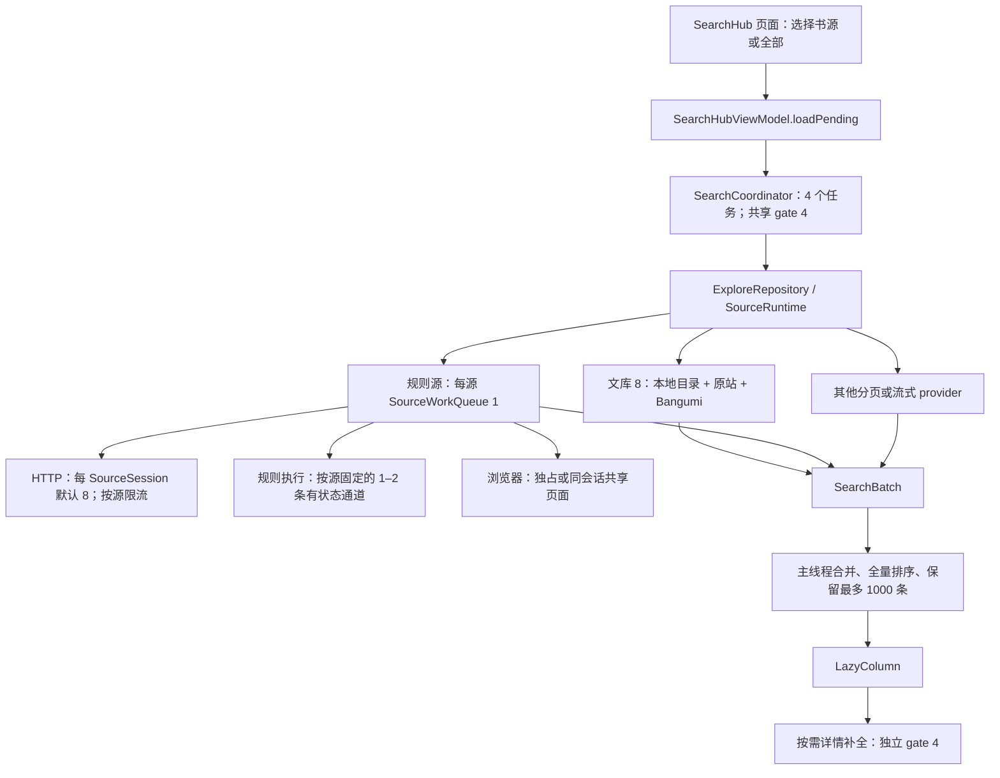

# 多书源搜索：并发链路与排序方案

本轮只交付排查结论和设计，不修改业务代码。分析基线为 NextVol `fcbf2ac6095cf0f41f65b09d9b1590b35b28ab9b`；参考本地 so-novel `76150dbd2827b4de97cde83cffb3ee367bc9be3a`、legado-with-MD3 `fb01a76ebbbca41423e2c4c00080cc0861239fbd` 的干净工作树。本文中的现状均指这些版本。

## 结论与优先级

**建议把聚合搜索的活动书源页任务上限统一为 8，但保留解析进程、详情补全、浏览器和站点限流各自的预算。** 当前搜索确实并发，问题是外层容量为 4、慢任务占槽、规则解析与浏览器存在更窄的通道，以及 UI 的“未完成”状态没有区分排队和实际执行。

排序优先修复统一语义和稳定性，再加轻量模糊匹配。采用“明确的匹配等级 + 预计算分数 + 确定性末级排序”，不增加搜索请求、不为了排名补拉全部详情、不因低相似度丢弃原站结果。

| 优先级 | 判断 | 建议 |
| --- | --- | --- |
| P1 | 4 个慢源可挡住其后的快源；改为 8 对独立 I/O 有直接收益 | 两处调度限制使用同一个搜索常量，保留跨查询共享 gate |
| P1 | 通用分数与文库 8 分数语义冲突，同档普通结果受返回先后影响 | 统一匹配等级，给所有结果确定性排序键 |
| P1 | 详情成功后不会更新排名；纯预览更新也存在被忽略的分支 | 已发生的元数据补全回写候选与排序依据，带查询和源版本校验 |
| P2 | 普通规则搜索逐行、逐字段经过有状态执行通道，扩大外层并发不能解决 CPU/IPC 瓶颈 | 验证无副作用的搜索规则批处理，复用现有独立执行池，不增加进程数 |
| P2 | 启动、排队、网络和解析都被外层 30 秒归入一个等待窗口 | 增加分阶段诊断，区分排队超时、网络错误与执行错误，再调整预算 |
| 保留 | 同源状态顺序、站点频率、浏览器账号切换隔离有实际作用 | 不机械地把所有 `1/2/4` 改成 `8` |

## 当前调用链

入口仍有旧的单源 `ExploreSearchViewModel` 路由；本轮的“多书源并发 8”和排序方案针对 `SearchHub`，包含它的单源筛选模式，不等于迁移旧入口。[S1]

### 并发是真的，但每层含义不同

| 层 | 当前机制 | 对搜索的实际影响 |
| --- | --- | --- |
| 搜索调度 | `flatMapMerge(4)`，每个内层 flow 在 IO dispatcher 上收集；Singleton `Semaphore(4)` | 最多 4 个活动页任务，不是顺序 `map`；共享 gate 还限制替换查询期间的新旧任务总量 [S2] |
| 源初始化 | 每个 registry entry 自己持有 lazy deferred；短锁保护注册状态 | 没有持有全局 registry 锁等待整次网络搜索，不能把 registry 认定为全局串行根因 [S3] |
| 规则源 | `RuleSource.operation` 在该源的 `SourceWorkQueue(1)` 内执行完整操作 | 同源搜索会与该源其他操作排队；不同源有各自的队列 [S4] |
| 规则解析 | 搜索 `RuleEvaluation.readOnly` 默认 false；执行器按源身份散列分配有状态通道 | 通常 2 条，低内存或小池为 1 条；多个源可能落在同一条通道 [S5] |
| 独立解析池 | 无副作用的专用任务或 `Rule(readOnly=true)` 才进入独立池 | 最大总池为 5 个进程，其中有状态 2、独立 3；搜索不能仅因使用 CSS 规则就自动进入独立池 [S5] |
| HTTP broker | 每个 `SourceSession` 默认 8；OkHttp 总请求和每主机上限也设为 8 | 此处已排除 OkHttp 默认每主机 5 的暗中降档；8 是每会话容量，不是全应用 HTTP 总上限 [S6] |
| 站点频率 | `concurrentRate=M` 表示每 M 毫秒一次，`N/M` 表示固定窗口 N 次 | 这是请求启动频率，不能当成线程数量；重试、跳转、桥接仍受各自预算约束 [S7] |
| 浏览器 | mediated browser 为全局 Mutex；native browser 正常设备容量 8、低内存设备 2 | native 只有同 session、同路由、Cookie 版本一致且符合只读页面条件时共享；不同源的会话切换仍要独占 [S8] |
| 详情补全 | 每个 SearchHub ViewModel 独立 gate 4，只有收集行的 information flow 才触发 | 与搜索页任务不是同一预算；页面重排、行进入视口可能带来额外工作 [S9] |
| 文库 8 | 本地、原站、Bangumi 三路渐进合并；原站搜索 Mutex + 至少 5 秒启动间隔 | 补充召回最多 20 秒，任务可在已有结果时继续占一个搜索槽；Bangumi 的 4 请求 gate 包含备用线路 [S10] |

**1–2 条有状态通道限制的是同时执行的规则调用，不等于所有规则源的 HTTP 都串行。** 普通静态 HTTP 在宿主侧可以重叠；但规则脚本内的同步 Ajax 会占着 worker 等网络，把网络慢进一步放大成同通道其他源的等待。[S5]

`sources/execution/README.md` 的开头仍写“全局一次 invocation、无队列”，与当前 `AndroidIsolatedExecutor.WorkerPool` 不一致。本轮判断依据实际源码；文档维护应与以后执行器变更一起处理，不据旧文字判断搜索完全串行。

### 哪些地方会退化

1. **慢源占满外层名额。** 每个槽覆盖打开来源、整页抓取/解析及渐进补充的完整生命周期。前 4 个源很慢时，第 5 个源还没有进入自己的 30 秒计时。UI 把这些源都表示为 pending，仅凭进度数看不出是在排队还是在请求。[S2][S9]
2. **双重等待。** 取得外层 gate 后才启动 30 秒 timeout；但源内操作队列、worker 排队、浏览器等待、HTTP 等待都在这个 30 秒内。`RuleSource` 自身 60 秒操作计时从源内准入后开始，并不能覆盖或延长外层期限。外层超时最终映射成 `DiscoveryError.Network`，即使真正耗时的是执行器排队。[S2][S4]
3. **取消等待可能越过 30 秒。** 新查询会等旧查询释放共享 gate。对不及时响应取消的 provider，这是保护总并发的正确行为，但共享 gate 的等待本身没有纳入新查询的 30 秒。不能靠每次创建新 Semaphore“加速”，那会让旧请求继续跑并突破预算。[S2]
4. **普通搜索尚未享受发现页的批解析。** `openSearchPages → listPage` 的 `overview=false`，`booksFromPage` 逐行提取 title、author、intro、cover 等字段；每个非空规则可形成独立 worker 调用。发现预览的 `BookOverviews` 批处理只在 `overview && canDeferBookFields` 路径生效。直接把搜索标成 overview 会丢作者等排序输入，不能这样复用。[S4][S11]
5. **UI 批次开销。** `accept` 在 `viewModelScope.launch` 的收集端执行，每批重新排序所有候选；比较器反复读取标题/作者做字符串比较。旧流式 provider 首本立即发出，随后每 16 本一批；普通分页源等整页完成，文库 8 则可多次发出增量。并发提高后，批次也可能更密。[S2][S9]
6. **资源预算并不相加为 8。** 8 个源各自可能有 8 个 HTTP 槽，另有详情、封面、脚本 `ajaxAll` 和补充召回。活动页上限 8 不能表述为“全应用最多 8 个网络请求”。评估内存时要同时看正文/响应体、解析输入、worker 和 WebView，而不只看协程数量。

搜索请求当前也没有像旧单源入口一样显式携带 `ForegroundSourceRequest`。`SourceRuntime.execute` 的优先级推导不覆盖全部 observe 路径。后续若需要提高搜索调度优先级，应传宿主调度元数据 `SourceWorkRequest`，不要为了优先级顺便授予批量弹出交互验证的权限。[S12]

## 当前排序与已确认问题

`SearchHubViewModel.rankedResults()` 的第一排序键是 provider 的 `score`；只有它为空才使用下表，数值越小越靠前。[S9]

| 普通结果情况 | 分数 |
| --- | --- |
| 标题或作者等于关键词，忽略大小写 | 0 |
| 标题或作者包含关键词，忽略大小写 | 10 |
| 有元数据但未匹配 | 20 |
| 没有 preview 元数据 | 30 |

第二排序键：有 provider score 时用绑定后的 book ID，否则用空字符串。普通同档结果借助稳定排序保留 `LinkedHashMap` 插入顺序，所以网络到达先后会改变最终顺序。同分混合结果中，未评分项的空字符串也会排在评分项 ID 前。UI 直接展示这一全局列表，每行标注来源；没有先按来源分块再排序。[S9]

文库 8 则先做简繁、NFKC、大小写和标点归一化：名称完全匹配 0、前缀 10、包含 20、长度至少 4 的单编辑匹配 40；作者分数再加 5。Bangumi 精确名称映射 5、标签候选 10、其他候选 30，关系展开逐层加 1，原站补搜 15，纯数字 ID 后备 50。这里混合了文本匹配、别名、关系与召回渠道，并非跨源通用的相似度标尺。[S10][S13]

由此产生的确定性问题：

- 文库 8 的“一字拼错但很接近”40，会输给其他源“完全不相关”20；其他源普通包含10也会压过文库8包含20。
- 通用排序没有文库 8 的规范化能力，全角、简繁或多余空白可能改变匹配档位。
- `details()` 成功后只更新闭包缓存并 emit 给行，未更新 `results[id].preview`，也未触发重新排名。一个最初只带 ID 的精确命中可一直留在缺信息档。
- `accept()` 只有 score 改善或拿到 completeInfo 才替换已有项。相同分数的新预览可能被忽略；即使进入更新分支，已有非空旧 preview 也先于新预览取值。需要定义元数据的完整度和版本，而不是只保留最小分数。
- 跨源同名书不会合并，因为身份是 source + bookId。这应保留：同名不保证同作品、同译本或同版本。排序完善不应顺便改变存储身份和打开书籍的路由。

## 参考实现：借什么，改什么

### so-novel

`AggregatedSearchAction` 为每个源提交一个 Java 虚拟线程，用 `CountDownLatch` 等全部完成，之后统一调用 `SearchResultsHandler.filterAndSort`。这段聚合入口没有搜索任务数上限，不能因为项目里存在 `VirtualThreadLimiter` 就认定聚合搜索使用了它。[R1]

值得借鉴的是预计算 title/author 两个分数和明确的末级排序。需要调整的有三点：[R2]

- 它根据所有候选相似度的加权总和推断“搜书名还是作者”。流式返回下，晚到的一批作者作品可能翻转意图并重排整页；NextVol 应采用每个候选的最佳字段匹配，明确搜索类型时再按类型限制字段。
- 它启用过滤时优先保留相似度大于 0.25 的结果；过滤为空时仍会丢弃 0 分项。短词、长轻小说标题、缩写或跨语言别名容易被误删。NextVol 默认只排序，保留原站召回。
- 其依赖 Hutool 5.8.46 的 `StrUtil.similar`。该版本源码注释写 Levenshtein，但实际递推是**最长公共子序列 LCS / 较长字符串长度**，并分配二维矩阵，时间与空间均为 O(mn)。它仅保留基本汉字、ASCII 字母和数字，丢弃假名等文字。[R3]

直接运行相同版本 Hutool 的结果：`similar("とある", "さくら") = 1.0`，因为两边都被清为空；`similar("ab", "ba") = 0.5`，对应 LCS 而非归一化编辑距离；`similar("凡人", "凡人修仙传之仙界篇") = 0.2222222222`，在存在其他高分结果时可被 0.25 过滤门槛排除。**不直接移植这个实现，也不为排序引入 Hutool。**

### legado-with-MD3

当前本地版本的 `SearchBooksUseCase` 使用 `flatMapMerge(concurrency)`，每个源 30 秒，逐源发 Progress；并发来自下载/缓存设置的 `threadCount`，默认 16。来源元数据阶段先对全部源创建 async 再 awaitAll，这个初始化屏障和复用下载配置都不适合直接照搬。[R4]

其结果合并与 UI 排序采用完全匹配、标签包含、书名/作者包含、其他几个档位；前三档用来源数降序，其他结果保留顺序；同名同作者聚合 origin，最多保留 1000 条。[R4][R5]

可以借鉴渐进返回、结果上限和分档可解释性。NextVol 保留 source + bookId 身份；来源数量不能直接代表相关性，重复或镜像源也会抬高这个数。标签召回应低于直接标题匹配。这个版本主搜索排序并未使用连续相似度；`BookHelp` 中的 Jaccard 用于换源后章节名定位，不应误当成其搜索排序算法。[R6]

## 建议设计

### 1. 搜索并发 8：明确边界

- 在搜索协调器内定义一个 `SEARCH_CONCURRENCY = 8`，同时供 `flatMapMerge` 和跨 run gate 使用。搜索策略不必依赖 network 模块的默认值；数值对齐，职责仍分开。
- 保留每次每源一页、按需下一页、1000 条候选上限、源身份与 epoch 检查。保留 bounded flow，不对所有书源一次性创建待运行 coroutine。
- 详情先保留 4；Bangumi 保留 4；有状态通道、独立进程和浏览器容量先保持当前自适应预算；站点 5 秒间隔和 `concurrentRate` 继续生效。
- 新查询取消旧查询，旧任务结束前仍占自己的名额。先补充“等待共享 gate”的可取消预算和诊断，不允许超时后假释放仍在执行的任务；不合作的插件应单独处理。
- 首批结果立即显示；后续密集更新可在约 50–100 ms 窗口合并，窗口值由帧耗时验收。结束、错误、停止事件必须冲刷尚未发布的批次，不能用只保留最后一个原始增量的 `conflate` 丢书。

这一步对独立 I/O 和“前 4 个源很慢”的组合最有效。遇到 8 个慢源仍会占满 8 个槽，所以它是容量修正，不替代下游优化。第一轮不引入按历史速度淘汰来源、自适应线程算法或浏览器池扩容。

### 2. 统一排序：等级先于相似度

主键不再接受来源随意定义的 Int 混排。宿主计算通用文本等级，来源只能附带明确的匹配证据，例如 VerifiedAlias、ExplicitId、Related 或 Tag；由宿主映射。现有 `SearchPage.scores` 是宿主适配层契约，迁移时保留兼容桥并枚举文库 8 的所有生产分支，不把一个分数区间直接冒充通用意义。

建议首版等级如下，数值小者优先；这是待验收的产品策略：

| 等级 | 证据 |
| --- | --- |
| 0 | 规范化标题/作者完全匹配，或来源已验证的显式 ID 命中 |
| 1 | 来源提供的可信别名完全匹配；不能把“续作/系列相关”冒充别名 |
| 2 | 标题/作者前缀匹配 |
| 3 | 标题/作者子串匹配 |
| 4 | 达到长度与距离门槛的模糊匹配 |
| 5 | 系列关系、标签或标点宽松匹配等补充证据 |
| 6 | 有标题/作者，但没有上述证据的原站召回 |
| 7 | 暂无可评分元数据 |

同档依次比较字段优先级（标题优先于作者）、该档细分分数（例如覆盖率或编辑相似度）、提交查询时冻结的来源顺序、源身份与原始 bookId。所有末级键都来自数据，不使用网络完成时间。分数预先计算一次，不在 sort comparator 中做归一化或动态规划。

规范化使用 NFKC、`Locale.ROOT` 小写、首尾/连续空白整理，并复用项目现有简繁转换。保留假名、数字、非 BMP 字符及有意义的标点；另建可选宽松键时，空键不能算匹配，宽松命中也不提升为完全匹配。保留原始显示文本，不能用规范化标题合并书籍；同档 raw ID 仍是最终稳定键。

模糊匹配先试**有界编辑距离**：query 至少 4 个 Unicode code point；4–7 字允许距离 1，8 字以上允许距离 2，且归一化相似度至少 0.75。先检查长度差，采用带状/双行 DP 和提前退出；任一字段超过 128 code point 时首版跳过模糊评分，仍保留完整文本的精确/前缀/包含匹配和原站结果。短查询不启用模糊，别名依靠已有证据。这些阈值需要用真实查询样本校准，但不会改变是否保留结果。

不加向量模型、全文索引服务、额外联网重排或通用分词依赖。只有最多 1000 条候选，缓存单次查询的规范化字段和分数已经足够；无需为此引入树、堆或持久排名缓存。

### 3. 元数据更新与显示稳定性

搜索页已有的 title/author 优先用于排名。可见行本来就在做的详情补全成功后，带查询 epoch、来源版本和 bookId 回写候选；它只改善当前候选的元数据，不另起一轮全量详情获取。新的完整元数据优于预览；同完整度按版本更新，不能永远取历史最低分掩盖内容变化。

每个发生变化的候选只重算一次 rank key，然后统一排序。没有候选/分数变化的完成通知只更新进度。先保留 1000 条规模下的简单排序；若目标机的批次排名 p95 超过 4 ms，再把不可变候选快照的计算移到 Default dispatcher，提交时校验 epoch 和候选修订号，避免旧排序覆盖新结果。

“确定性最终顺序”与“流式期间完全不动”不能同时成立：晚到的精确结果需要前移。以书籍 ID 保持 LazyColumn key，合并密集更新，保住当前阅读锚点；不通过点击/可见状态改变最终排名，也不等全部慢源完成才显示首屏。

### 4. 规则搜索的低占用提速

先用现有 `RuleExecutionTrace` 的 queueMs、Ready 等待、Start/End 和 `ContentTrace` 分开确认网络、排队、解析及存储成本。最值得推进的后续优化是**一次页面内的纯规则批提取**，减少每行每字段的 Binder 往返，并使用现有独立进程余量。

资格应经过已有规则分析器逐项确认：无 jsLib、无有状态 JS/写入、无登录钩子或未知行为，覆盖 URL、header、bookList、所有要批取的字段及 nextPage。处理 book 字段依赖、重定向到详情、cookies、查询 memory 与原路径一致；不能把所有 Rule 强设 readOnly。批处理仍提取搜索需要的标题、作者等完整字段，并受字节/行数上限限制，不能照搬只取标题/URL/封面的发现预览。

保持有状态来源原通道、失败取消语义和存储提交顺序。缓存只保留必要结果；批次消费后释放 DOM/响应体和临时 rank 数据，不在 ViewModel 持有所有源的原始页面。先降低 IPC 与重复分配，比新增 8 个 Rhino/WebView 实例更符合移动端目标。

## 本轮验证与后续验收

### 已运行的隔离实验

在仓库外用 Kotlin 2.4.10 / coroutines 1.11.0 编译**原样的 SearchCoordinator、SourceWorkQueue、PagedSearchProvider、SearchResult**，provider/Android 周边由最小测试替身提供；排序函数从基线 ViewModel 原样提取。另生成仅把协调器两处 4 改成 8 的实验副本。以下时间为协程测试调度器的虚拟时间，验证调度语义，不是 Android 性能或真实站点测速。

| 场景 | 当前 4 | 实验 8 | 验证结论 |
| --- | --- | --- | --- |
| 16 个独立任务，每个挂起 100 ms | 峰值4，400 ms完成 | 峰值8，200 ms完成 | 外层确实并发；I/O 独立时扩大容量有效 |
| 前4个任务挂起至30秒超时，后4个耗时100 ms | 首个快结果30,100 ms | 首个快结果100 ms | 复现慢源占满任务槽 |
| 同样16任务，模拟均匀进入两条真实 SourceWorkQueue，各100 ms | 执行峰值2，800 ms | 执行峰值2，800 ms | 下游通道不变时，外层扩容无收益 |
| 旧4任务在 NonCancellable 清理中等待35秒，再提交新查询 | 新查询35秒才准入，35,100 ms完成 | 未运行此变体 | 新查询的30秒不包含外层 gate 等待 |

原样排序函数还复现：普通同档项交换返回顺序会交换最终顺序；普通无关20先于来源模糊40；全角 `Ｔｉｔｌｅ` 对查询 `Title` 落入普通无关档；缺 preview 为30。Hutool 5.8.46 的三个数值实验见参考实现部分。

上述探针、依赖和原始记录留在仓库外。此次没有运行 Android 构建或本地全量测试，没有真实设备 CPU/PSS/帧时间样本。现有 `SearchHubViewModelTest` 已有1000源峰值4、取消替换、分页、部分结果、评分项稳定性等测试，源码审查用于明确未来回归点，不记作本轮已执行测试。[S14]

### 实施时必须通过的针对性验收

| 范围 | 验收条件 |
| --- | --- |
| 协调器 | 1000个来源只创建受限活动任务；8个独立阻塞 provider 均启动，第9个等待；替换查询时新旧总活动数不超8 |
| 等待/取消 | 前4慢后4快、8慢后快、同源排队、同worker散列碰撞、浏览器切源分别覆盖；取消不串结果、不泄漏 permit |
| 排序 | 固定候选集合，打乱到达/批次顺序后最终顺序相同；标题、作者、别名、简繁、全角、假名、数字、标点、短词、长标题与错字均有样本 |
| 元数据 | ID-only→完整详情、预览→新预览→完整详情、旧查询详情晚回、账号/版本变化均验证；不新增为了排序的网络请求 |
| 分页/召回 | 停止恢复、重复页、空页有 continuation、来源失败保留部分结果、达到1000条后确定性保留；同名跨源身份仍独立 |
| 纯规则批处理 | 与原链路逐字段输出/状态/错误对照；JS、library、登录钩子、行间依赖及详情重定向退回原语义；进程数不增加 |
| 移动端资源 | 普通HTTP、规则、浏览器和混合源分别在普通/低内存设备比较4与8；记录首本可用/首屏前10条时间、完成p50/p95、请求数、429、CPU、PSS、帧耗时及取消释放时间 |

资源门槛建议：排序不增加网络请求；无worker/WebView进程预算扩张；受控独立I/O样本8并发确实优于4；匹配质量与失败率不退化；候选合并排名主线程p95目标不超过4 ms。内存增量按实际输入规模记录后再制定绝对门槛，不用虚拟调度耗时推算真实手机收益。

实施顺序建议为三项独立交付：先搜索调度8及等待诊断，再统一排序/元数据回写，最后通过资格检查的规则批处理。每项另建一个实现主issue及其专属worktree、branch、PR。本轮PR只完成调研，不表示这些改动已经落地。

## 源码依据

正文链接固定到上述提交，便于复核。主要入口为 [NextVol 搜索调度][S2]、[NextVol 合并与排序][S9]、[so-novel 相似度排序][R2] 和 [Legado 搜索用例][R4]；算法依赖另核对了 [Hutool 5.8.46 源码包][R3]。

[S1]: https://github.com/Renakoni/nextvol/blob/fcbf2ac6095cf0f41f65b09d9b1590b35b28ab9b/app/src/main/kotlin/indi/renakoni/nextvol/ui/home/explore/search/Navigation.kt#L20
[S2]: https://github.com/Renakoni/nextvol/blob/fcbf2ac6095cf0f41f65b09d9b1590b35b28ab9b/app/src/main/kotlin/indi/renakoni/nextvol/data/explore/SearchCoordinator.kt#L26
[S3]: https://github.com/Renakoni/nextvol/blob/fcbf2ac6095cf0f41f65b09d9b1590b35b28ab9b/app/src/main/kotlin/indi/renakoni/nextvol/data/web/WebSourceRegistry.kt#L107
[S4]: https://github.com/Renakoni/nextvol/blob/fcbf2ac6095cf0f41f65b09d9b1590b35b28ab9b/sources/content/src/main/kotlin/hnovel/content/RuleSource.kt#L228
[S5]: https://github.com/Renakoni/nextvol/blob/fcbf2ac6095cf0f41f65b09d9b1590b35b28ab9b/app/src/main/kotlin/indi/renakoni/nextvol/sourceexecution/AndroidIsolatedExecutor.kt#L297
[S6]: https://github.com/Renakoni/nextvol/blob/fcbf2ac6095cf0f41f65b09d9b1590b35b28ab9b/sources/network/src/main/kotlin/hnovel/network/SourceBroker.kt#L123
[S7]: https://github.com/Renakoni/nextvol/blob/fcbf2ac6095cf0f41f65b09d9b1590b35b28ab9b/sources/network/src/main/kotlin/hnovel/network/SourceRequestPacer.kt#L9
[S8]: https://github.com/Renakoni/nextvol/blob/fcbf2ac6095cf0f41f65b09d9b1590b35b28ab9b/app/src/main/kotlin/indi/renakoni/nextvol/sourcebrowser/NativeSourceBrowser.kt#L174
[S9]: https://github.com/Renakoni/nextvol/blob/fcbf2ac6095cf0f41f65b09d9b1590b35b28ab9b/app/src/main/kotlin/indi/renakoni/nextvol/ui/home/explore/search/SearchHubViewModel.kt#L203
[S10]: https://github.com/Renakoni/nextvol/blob/fcbf2ac6095cf0f41f65b09d9b1590b35b28ab9b/app/src/main/kotlin/indi/renakoni/nextvol/defaultplugin/wenku8/search/Wenku8SearchSession.kt#L34
[S11]: https://github.com/Renakoni/nextvol/blob/fcbf2ac6095cf0f41f65b09d9b1590b35b28ab9b/sources/content/src/main/kotlin/hnovel/content/RuleSource.kt#L455
[S12]: https://github.com/Renakoni/nextvol/blob/fcbf2ac6095cf0f41f65b09d9b1590b35b28ab9b/app/src/main/kotlin/indi/renakoni/nextvol/data/web/SourceRuntime.kt#L57
[S13]: https://github.com/Renakoni/nextvol/blob/fcbf2ac6095cf0f41f65b09d9b1590b35b28ab9b/app/src/main/kotlin/indi/renakoni/nextvol/defaultplugin/wenku8/search/Wenku8SearchText.kt#L28
[S14]: https://github.com/Renakoni/nextvol/blob/fcbf2ac6095cf0f41f65b09d9b1590b35b28ab9b/app/src/test/kotlin/indi/renakoni/nextvol/ui/home/explore/SearchHubViewModelTest.kt#L97
[R1]: https://github.com/freeok/so-novel/blob/76150dbd2827b4de97cde83cffb3ee367bc9be3a/src/main/java/com/pcdd/sonovel/actions/AggregatedSearchAction.java#L51
[R2]: https://github.com/freeok/so-novel/blob/76150dbd2827b4de97cde83cffb3ee367bc9be3a/src/main/java/com/pcdd/sonovel/handler/SearchResultsHandler.java#L21
[R3]: https://repo.maven.apache.org/maven2/cn/hutool/hutool-core/5.8.46/hutool-core-5.8.46-sources.jar
[R4]: https://github.com/HapeLee/legado-with-MD3/blob/fb01a76ebbbca41423e2c4c00080cc0861239fbd/app/src/main/java/io/legado/app/domain/usecase/SearchBooksUseCase.kt#L76
[R5]: https://github.com/HapeLee/legado-with-MD3/blob/fb01a76ebbbca41423e2c4c00080cc0861239fbd/app/src/main/java/io/legado/app/ui/book/search/SearchViewModel.kt#L1012
[R6]: https://github.com/HapeLee/legado-with-MD3/blob/fb01a76ebbbca41423e2c4c00080cc0861239fbd/app/src/main/java/io/legado/app/help/book/BookHelp.kt#L830
